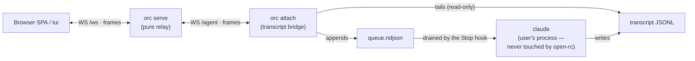

# CLAUDE.md

Project memory for Claude Code (and any future Claude agents) working
on open-rc. Read this before changing anything.

---

## Project goal

**Share an ALREADY-RUNNING Claude Code session with a browser —
including a phone. The goal is to share an existing session, NOT to
start a new one.**

The user already has a `claude` running (in a terminal, however they
like). open-rc's job is to make *that* session visible and driveable
from a browser: the browser sees the live stream and can send prompts,
and those prompts land in the same running session. open-rc does not
start `claude`, does not own it, does not manage its lifecycle.

> **Launching processes is permanently out of scope.** There is no
> `child_process`, no `fork`, no `exec`, no PTY, no tmux anywhere in
> the project. If you think you need to launch something, stop —
> share the session from the outside instead (transcript + hooks,
> like `attach-orc` does).

Two halves ship today (requested 2026-07-02: "fully share the session
between the browser and the CLI … not by spawning"):

- **`orc serve`** — a pure WebSocket relay. It does not start
  `claude`, does not manage it, does not know `claude` is a process.
- **`orc attach` + the `/orc` slash command + the
  `orc hook` handlers** — the first-party, spawn-free way to feed
  the relay from an ALREADY-RUNNING interactive Claude Code session.
  The bridge reads the transcript JSONL the session itself writes
  (session→browser) and Claude Code's Stop/UserPromptSubmit/SessionEnd
  hooks deliver queued browser prompts back into the session at turn
  boundaries (browser→session). It never touches the process.



A user-authored stdio bridge (pipe a stream-json `claude` to `/agent`)
remains equally supported — the relay treats both identically.

The motivation: Claude Code's native RemoteControl is locked to
claude.ai OAuth + Trusted Device enrollment, so non-Anthropic
providers (Deepseek, GLM, MiniMax, etc.) can't ride it. open-rc
rebuilds the same UX against any provider by relaying the public
`stream-json` wire format. The relay itself doesn't care what feeds it.

---

## Required features (must ship)

- **Shared session via `/orc` (2026-07-02, explicit user goal).**
  Inside a running Claude Code session, `/orc` makes THAT
  session appear in the browser sidebar; clicking it shows the full
  history and a working composer; messages can be read and sent from
  the CLI and the browser alike; nothing is spawned. Mechanics:
  `commands/orc.md` runs `orc attach` in the background
  (via the session's own Bash tool — user-initiated, not open-rc);
  the bridge resolves the newest transcript JSONL for the cwd, uses
  the session id as clientId, replays + tails it to `/agent`, and
  queues incoming `prompt` frames to `~/.open-rc/attach/<sessionId>/`;
  the `orc hook stop|prompt|end` handlers (installed into
  `~/.claude/settings.json` by `make setup`) drain that queue — Stop
  blocks with the messages as reason (delivery at turn ends, with an
  ADAPTIVE linger window: 45 s normally (`ORC_STOP_LINGER_MS`),
  UNLIMITED while the conversation is browser-driven — and a viewer
  ATTACHING flips browser-driven mode on immediately (the bridge
  touches the marker on `attached count>0`), so even the FIRST remote
  message has no window to miss (`ORC_STOP_LINGER_ACTIVE_MS` caps it if set; tracked
  via `browser-turn.marker`; 5 min then 30 min both proved to be
  cliffs — went unlimited 2026-07-03, no env cap. Esc hands the
  prompt back to the terminal instantly; the next real CLI prompt
  clears browser-driven mode. EMPIRICALLY VERIFIED 2026-07-03 on a
  live claude in tmux: (a) a prompt typed during a running Stop hook
  QUEUES until the hook exits — it does NOT cancel the hook, so the
  SHORT window must stay short; (b) pressing Esc DOES cancel a
  running Stop hook immediately and the prompt returns — that is the
  terminal-side priority handoff, no extra command needed).
  UserPromptSubmit attaches queued messages
  as context, Notification (`hook notify`) shows "browser message
  waiting" in an idle terminal, SessionEnd tells the bridge to exit.
  Known, accepted limitation: a browser message sent while the
  session is idle past its window waits for the next session
  activity — there is no way to wake an idle interactive `claude`
  without PTY/tmux/spawn, and those stay banned (the
  Notification/idle hook cannot inject; verified against docs
  2026-07-03). The bridge makes that state visible: a prompt queued
  with no plausible listening window open gets an immediate `error`
  frame back ("message queued — the session is idle…"), so viewers
  are never left staring at silence.
- **Sidebar of currently-connected clients.** 300 px sidebar on the
  left, always visible on desktop, slides in/out on mobile. Each row
  = one currently-open WebSocket to `orc serve` from a user's
  bridge. Columns: status dot, client label, abbreviated cwd,
  last-activity timestamp.
- **Multiple concurrent clients.** The server holds N clients at once.
  Each client has its own clientId, label, cwd, status, and
  lastActivity. Clicking a row attaches the UI to that client's
  stream.
- **Browser → client prompt routing.** The browser sends
  `attach { clientId }` to start receiving that client's frames,
  then `send { clientId, text }` for prompts. The server forwards the
  prompt as a `send` frame on the client WS.
- **Client → browser event routing.** Whatever the bridge sends on
  the client WS (typically translated `stream-json` frames) is fanned
  out to every browser that has attached to that clientId.
- **Permission forwarding (server-side support).** When a client
  sends `permission_request`, the server forwards it to every
  attached browser. The browser replies with `permission_response
  { clientId, requestId, approved }`. The server forwards it back to
  the client. Whether permission forwarding is actually used depends
  on the user's bridge (e.g., whether their bridge wires a
  PreToolUse hook into `claude`); the server just relays.
- **Detach.** Browser sends `detach`. The server unsubscribes the
  browser from that clientId. Other browsers and the client are
  unaffected.
- **Disconnect detection.** When a client WS closes, the server
  marks the client as `exited` and broadcasts `clients_changed`.
- **Mobile.** Sidebar collapses; selecting a row slides the chat
  pane in from the right; a back button in the chat header slides
  the sidebar back in. No drawer, no toggle — sliding panes.
- **Login gate** (2026-07-04). `ORC_USER`+`ORC_PASSWORD` on the
  server arm a sign-in page (`/login`, plain form POST, no SPA/SW
  dependency); the session cookie is a stateless HMAC of the
  credentials (`src/auth/session.ts`) with a 10-year Max-Age —
  infinite by request, survives restarts, revoked wholesale by
  changing the password. `/ws` accepts the cookie or
  `Authorization: Basic` from `ORC_AUTH=user:password` (how `tui`
  signs in; bakeable via `make setup ORC_AUTH=…`). **`/agent` is
  deliberately UNGATED even with auth armed** (owner's call,
  2026-07-05): bridges connect with zero ceremony, and an /agent
  client can only register its own session, never read others.
  Public without auth: `/login`, `/health`, sw.js, manifest, icons.
  Unset = fully open as before. Bare `USER` was deliberately NOT
  used (always set by shells).
- **Web Push** (already shipped, keep). When a session emits `done`,
  subscribed browsers get a notification with a snippet of the result.
- **Hub mode** (already shipped, keep). Optional relay so multiple
  devices / multiple users can drive the same set of clients.

---

## Explicit non-features (do NOT implement)

- **open-rc starts no processes — the whole project, not just the
  server.** It launches nothing, inspects no process table (`ps`,
  `lsof`, `/proc`), and signals no process; there is no
  `child_process`, `fork`, `exec`, PTY, or tmux anywhere in the code.
  A `claude` running in another terminal is invisible to open-rc
  except through (a) frames a bridge sends over a WebSocket and
  (b) the transcript JSONL that session itself writes, which
  `attach-orc` reads read-only. The CLI surface is exactly `serve`,
  `hub`, `tui`, `attach`, and `hook` (binary name: `orc`) — and none
  of them spawn.
  History note: an earlier `attach-orc` that SPAWNED `claude --print`,
  and `attach-tmux` (tmux mirror), were removed on 2026-07-02 as a
  deliberate, requested decision; later the same day the user
  explicitly requested full browser/CLI session sharing "not by
  spawning", which is why today's `attach-orc` exists as a
  transcript+hooks bridge. Do not reintroduce spawning under any name.
- **`make setup` registers the `orc` launcher, the hooks, and the command.**
  It writes one launcher script to `~/.local/bin` (override `BIN_DIR`):
  `#!/bin/sh; exec bun run <checkout>/src/cli.ts … "$@"`, so the
  abs-path anchor lives in the launcher and a `git pull` updates
  behavior with no reinstall. Setup ASKS for the relay URL on the CLI
  (interactive runs; `ORC_BASE_URL=<url>` answers it up front, empty
  = no default) and bakes the answer into the launcher (`:=` — an env
  value still wins; re-run setup to change/clear). It then runs
  `scripts/install-hooks.ts`,
  which idempotently merges the Stop/UserPromptSubmit/SessionEnd hook
  entries (`<BIN_DIR>/orc hook <event>`) into
  `~/.claude/settings.json` — preserving all user hooks, never
  duplicating its own (recognized by the "orc hook" substring) —
  and symlinks `commands/orc.md` to
  `~/.claude/commands/orc.md`. `make teardown` reverses all of
  it. The hooks are instant no-ops for any session without a live
  bridge heartbeat under `~/.open-rc/attach/<sessionId>/`.
- **`orc tui` is a terminal front-end, not a bridge.** `tui` is a
  plain `/ws` client — the SAME protocol the browser SPA speaks. It
  attaches to a clientId and renders/sends frames; it runs nothing of
  its own and owns no `claude`. Its purpose is a **shared session**: a
  bridge (`orc attach` or user-owned) feeds one running `claude` to
  `/agent`, and the browser and one or more `tui` clients all attach
  to the same clientId, so a prompt from any of them is echoed to all
  (the server broadcasts a `user` frame on `send`) and the stream fans
  out to all. This is how "drive from the browser AND the CLI" is one
  conversation. It never touches `claude`'s stdio.
- **No reverse-engineering the bridge protocol.** open-rc talks to
  the public `--input-format stream-json --output-format stream-json`
  mode only. The private RemoteControl protocol and
  `wss://bridge.claudeusercontent.com` are off-limits.
- **No TTY splicing / PTY hijacking in the codebase.** open-rc ships
  no code that attaches to another process's controlling terminal,
  uses `TIOCSTI`/`TIOCSWINSZ`, or reverse-engineers claude's IPC. A
  `claude` in a terminal is a black box except for its transcript file
  (read-only, by `attach-orc`) and its hook callbacks (answered by
  `orc hook`). Delivery into an idle session therefore happens
  only at hook moments — that latency is the accepted price of the
  no-PTY rule; do not "fix" it with tmux/PTY/stdin tricks.
- **History = replay the live stream it's already relaying, in memory
  only.** The server keeps a bounded, per-connected-client ring buffer
  of the conversation frames it relays (`BridgeConn.history`, cap
  `MAX_HISTORY`) — text / thinking / tool_use / tool_result / done /
  error plus echoed `user` prompts, NOT the transient
  `permission_request` and NOT streaming `text_delta` fragments (the
  final `text` frame carries the same content; replaying both would
  render the reply twice) — and replays it to any browser/`tui` that
  attaches, so a reload or a late joiner sees the conversation so far
  instead of a blank pane. NOT disk persistence: the buffer is dropped
  when the bridge disconnects and is never written to disk. The SERVER
  never reads `claude`'s transcript files — deep history comes from the
  bridge side: `attach-orc` replays the session transcript (capped at
  `MAX_REPLAY_FRAMES`) into `/agent` on every (re)registration, and the
  server buffers/replays those frames like any others.
- **No DISK persistence on the server.** Mutable state is the in-memory
  `clients` map and each client's in-memory `history` buffer. Restart
  the server, lose both; clients reconnect and the map + fresh history
  rebuild. No sessions.json, no SQLite for sessions, no
  VAPID-persisted-server-side state beyond what the push subsystem needs.
- **No session creation or destruction by the server or browser.**
  The sidebar is *passive* — it shows what bridges are currently
  connected. Adding/removing a row in the sidebar does not start or
  stop anything.

---

## Wire protocols (one sentence each)

Two boundaries: browser ↔ `orc serve` on `/ws`, and bridge ↔
`orc serve` on `/agent` (zod schemas for both live in
`src/session/ws-protocol.ts`). The server relays; it never interprets
`stream-json` or transcripts itself.

- **Browser → Server (`/ws`).** Pick which client to watch, forward
  user prompts and permission decisions. Frames: `list_clients`,
  `attach`, `detach`, `send`, `permission_response`.
- **Server → Browser (`/ws`).** Broadcast the live client list,
  forward frames from the client the browser is watching. Frames:
  `clients_changed`, `client_registered`, `client_removed`,
  `client_list`, a `user` frame (the server's echo of any client's
  `send`, so every attached view renders the same prompt — this is
  what keeps a shared session in sync), plus whatever per-client
  frames the user's bridge sends (text / text_delta / thinking /
  tool_use / tool_result / permission_request / question / done /
  error, tagged with the clientId they came from; `question` is an
  AskUserQuestion relayed for remote answering, transient like
  `permission_request` — never replayed from history). `text_delta` is a streaming
  fragment of the in-progress reply — a bridge that has a token stream
  can send these (e.g. from `claude --include-partial-messages`) and
  the browser renders them live with a typing indicator while waiting;
  the server stamps `done` frames with a `ts` so turn dividers show a
  wall-clock time even on replay. The `tui` command speaks this exact
  same `/ws` protocol — it is just another attached client.
- **Bridge → Server (`/agent`).** `register` first, then the relayed
  frames above plus `user` (a prompt the bridge observed on ITS side,
  e.g. typed into the shared terminal and replayed from the
  transcript; prompts sent through the server are echoed by the server
  itself and must NOT be re-sent by the bridge — the attach bridge filters
  them by the `[open-rc]` marker), `status`, and `unregister`.
- **Server → Bridge (`/agent`).** `prompt` (a browser/tui `send`),
  `permission_response`, `question_response { requestId, answers }`
  (a viewer's answer to a relayed AskUserQuestion — the `ask`
  PreToolUse hook waits on it and returns it as the tool decision,
  which Claude accepts as the answer; verified empirically
  2026-07-03), `attached { count }` — how many viewers are
  watching, sent on every attach/detach so the Stop-hook linger runs
  only while someone is attached — and `ping` every 30 s (keepalive:
  proxies like Cloudflare drop idle WebSockets at ~100 s, and the
  bridge treats 120 s of server silence as a half-open link and
  reconnects; browsers get protocol-level pings instead, which their
  WS stacks auto-pong).

The server does not define a client-side protocol. A client WS that
speaks any framed WebSocket messages at all will work, because the
server's job is to forward them.

---

## Architecture summary

`orc serve` is a Bun.serve instance with one WebSocket upgrade
route:

- `GET /ws` — browsers (and `tui`) connect here. The server reads
  `attach` / `list_clients` / `send` / `permission_response` and
  routes frames to/from the right client WS.
- `GET /agent` — bridges connect here (`attach-orc` or user-owned).
- `GET /` and `GET /sessions/<id>` both serve the SPA shell. The
  browser reflects the active session in the URL path
  (`/sessions/<clientId>`, via `history.pushState`), so a reload or a
  shared link deep-links back to that session; the server's SPA
  fallback returns index.html for those paths. SPA assets are loaded
  with root-absolute paths (`/app.ts`, `/vendor/…`) so they resolve
  under a session subpath.

The server is a stateless relay beyond the in-memory `clients` map.
It starts no processes. It does not walk the process table. It
does not know what `claude` is.

The UI is a vanilla TypeScript SPA (`ui/app.ts`, no build step) with
a small home-grown signal implementation. Sidebar + chat-pane,
hand-rolled CSS with a token system. The one render dep (`marked`)
is vendored under `ui/vendor/` and resolved via importmap; assistant
markdown is sanitized before it touches innerHTML.

The user runs `claude` themselves. To share it, they either type
`/orc` in the session (first-party, transcript+hooks) or bring
their own stdio bridge — the relay treats both identically.

The attach side lives in `src/cli/attach.ts` (bridge),
`src/transcript/` (locate / translate / tail), `src/attach/state.ts`
(the `~/.open-rc/attach/<sessionId>/` filesystem contract), and
`src/cli/attach-hooks.ts` (`orc hook stop|prompt|end`). Turn
model: transcript `user` entry opens a turn, assistant/tool entries
keep it open, the Stop hook's marker (or the next `user` entry, as
fallback) closes it with a `done` frame.

---

## Past mistakes to avoid

- **Don't add a SPAWNING bridge.** The first `attach-orc` spawned
  `claude --print` and was rightly removed. The current `attach-orc`
  is allowed precisely because it spawns nothing: it reads the
  session's transcript and answers hook callbacks. Any future bridge
  work must keep that property — no stdio ownership, no lifecycle
  management, no process table.
- **Don't ship a single-session UI.** Multi-client is the whole
  point — the sidebar is non-negotiable.
- **Don't strip features because the user complained about one
  thing.** When feedback says "the icon is too small", the answer is
  to fix the icon, not to delete the whole feature.
- **Don't translate "X is banned" as "X must be removed".** "Takeover
  banned" means "don't kill other processes", not "remove the sidebar
  that lists clients". Takeover = external. Sidebar = currently-
  connected clients. Different things.
- **Don't add a "+ New session" button in the browser.** Clients are
  user-owned; the server doesn't create them. The sidebar is
  *passive* — it shows what bridges are currently connected.
- **Don't ask the user what they mean by obvious things.** If the
  user says "run claude locally", they mean "I run claude on my
  host machine", not "open-rc starts claude".
- **Don't write code before the docs agree.** When the model isn't
  settled, write the design doc first. Code is downstream of docs.
- **Don't leave process-launching references in comments.** If a
  comment implies launching a subprocess in a serving context, remove
  it. The constraint is the constraint.
- **If a future launcher is ever built, start `claude --print`, NOT
  `--bare`.** (Kept as a hard-won note; no launcher exists today.) Bare
  mode's Anthropic auth is strictly `ANTHROPIC_API_KEY`/`apiKeyHelper`
  (OAuth and keychain are never read), so on a subscription-login
  machine every prompt returns "Not logged in". `--print
  --input-format stream-json --output-format stream-json --verbose` is
  the same public wire format but resolves auth like the user's own
  `claude -p`. (Learned while `attach-orc` existed, 2026-07-02.)

---

## Style reminders

- Bun + TypeScript strict, vanilla TS SPA with a tiny signal
  implementation, importmap for vendored `marked` (no build step).
  See README for the canonical setup.
- `bun run build` (which calls `bun build --compile`) is for
  **distribution only** — it produces a single-file executable for
  users without Bun. It is NOT required to run the server in
  development. Launch the server with `bun run src/cli.ts serve`
  or `make serve`.
- Immutability, small files (200–400 lines), comprehensive error
  handling, zod for wire-protocol validation.
- Documentation follow-up is mandatory when code changes — update
  README, docs/roadmap, docs/architecture, docs/survey,
  docs/tech-stack, docs/docker, docs/deploy, SECURITY.md, and this
  file in the same task.
- Architecture diagrams in docs are written in **Mermaid**
  (```` ```mermaid ```` fenced blocks; requested 2026-07-03). ASCII
  art is reserved for terminal output (the Makefile banner).
- **Commit every change immediately, without being asked, and push.**
  After any substantive edit (once lint/typecheck/tests are green),
  `git add -A && git commit` and `git push` right away — never leave
  the working tree dirty, never wait for the user to say "commit". The
  user granted standing authorization for this repo (do not prompt).
  Commit message format: `<type>: <concise Japanese summary> @<branch>`
  (type ∈ feat/fix/refactor/chore/docs/test), subject line only.
- The CLI (binary `orc`) exposes five commands: `serve`, `hub`,
  `tui`, `attach`, and `hook` — none of which launch a process. `serve`/`hub` are
  byte-pass-through relays; `tui` is a `/ws` client; `attach` is
  the transcript bridge for the session it's invoked from; `hook` is
  the Claude Code hook handler set. There is no `attach-tmux`, no
  `pipe`, no `client` — launching processes is out of scope (see
  Project goal).
- Docker: `Dockerfile` + `docker-compose.yml` ship an all-in-one image
  (base `oven/bun:1.3-slim`) that runs the CLI from source — serve by
  default, `hub`/`tui` via args, state in the `/data` volume
  (`XDG_DATA_HOME`), port published loopback-only by default. The
  container is the relay half ONLY: no `claude`, no bridge, no hooks
  inside it; `/orc` runs on the host and dials the published
  port. Do not bake a bridge or claude into the image.
- PWA assets follow the same no-build-step rule: `ui/manifest.webmanifest`
  and the icon PNGs are checked in as static files and served
  straight off disk. PWA updates are AGGRESSIVE by design (requested
  2026-07-03): the server appends a `shell-rev` fingerprint of `ui/`
  to `/sw.js` (`src/serve/shell-rev.ts`) so any UI change registers
  as an SW update without a `CACHE_VERSION` bump; the SPA checks
  every 5 min + on foreground-resume/online, the SW `skipWaiting()`s
  after precache, and the page self-reloads on `controllerchange`
  (composer draft parked in `sessionStorage` across the reload). Do
  not re-introduce a "wait for the user to reload" update path. `scripts/build-icons.ts` is a maintainer-only
  helper (re-rasterises `ui/icon.svg` → icon PNGs); it is never run
  on the server boot path. `scripts/build.ts` (distribution cross-
  compile) does not touch UI assets — the no-UI-build rule survives
  PWA unchanged.