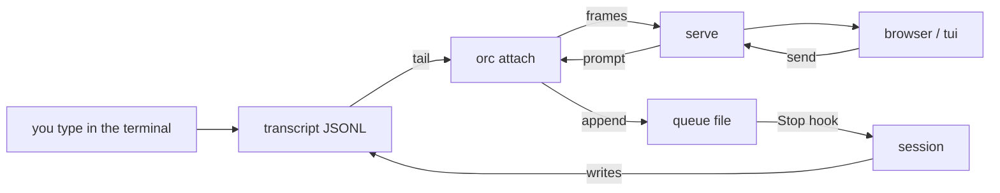
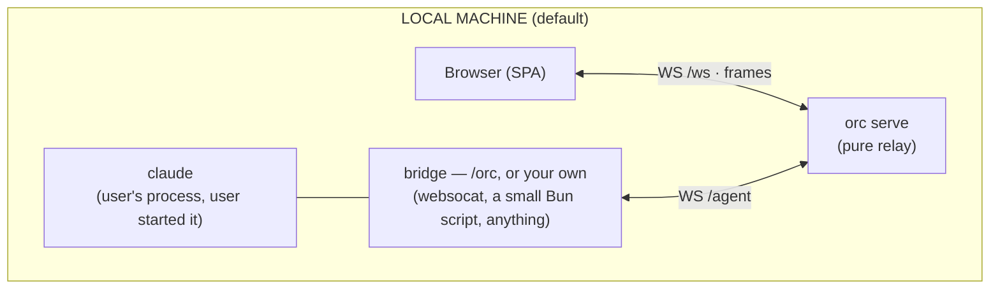
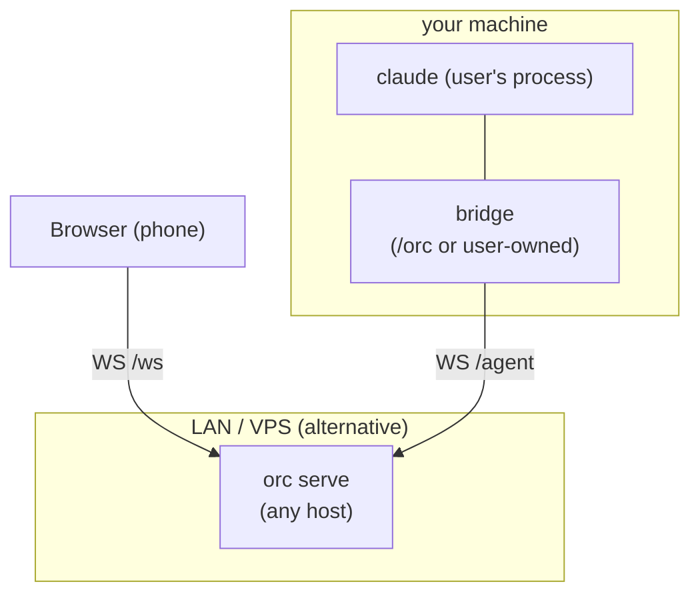

# Open Remote Control

> Claude Code's RemoteControl control plane — open, self-hostable, and
> usable against any Claude Code-compatible LLM provider. `open-rc`
> on the command line.

[](#status)
[](#license)
[](#requirements)

---

## What is Open Remote Control?

Claude Code's RemoteControl (driving a session from the web UI or
mobile app, peer-to-peer `SendUserMessage` across machines, push
notifications, `/teleport`, `/rewind`) is implemented as a **private
control plane** between the CLI and
`wss://bridge.claudeusercontent.com`. That control plane requires
claude.ai OAuth + Trusted Device enrollment, and is not available to
providers who only publish a Claude-Code-API-compatible inference
endpoint.

`open-rc` is a **drop-in replacement for that control plane**, as a
single thing: `orc serve`, a pure WebSocket relay.

The relay never starts or manages `claude`. The user runs `claude`
themselves on whichever machine they want, and arranges for the
`stream-json` frames to flow over a WebSocket to `orc serve`. The
browser connects to `orc serve`, sees the connected streams, and
sends prompts back.

> **TL;DR.** `open-rc` is the RemoteControl bridge that Claude Code
> normally gets from `wss://bridge.claudeusercontent.com`, but yours
> to host, with any provider. open-rc is the relay. The user brings
> their own `claude` and their own bridge.

---

## Quick start

```bash
# 1. Clone & install
git clone https://github.com/Cohey0727/OpenRemoteControl.git
cd OpenRemoteControl
bun install

# 2. Start the relay
bun run src/cli.ts serve --host 127.0.0.1 --port 7322
# → UI:  http://127.0.0.1:7322/
# → WS:  ws://127.0.0.1:7322/ws    (browsers)
# → /agent:  ws://127.0.0.1:7322/agent  (user-owned bridges)
```

That's the entire server. `orc serve` is a pure WebSocket relay.

### Or run the relay in Docker (all-in-one)

```bash
docker compose up -d          # build + run; UI on http://127.0.0.1:7322
# or, without compose:
docker build -t open-rc .
docker run -d -p 127.0.0.1:7322:7322 -v open-rc-data:/data open-rc
```

Docker is the recommended way to run the relay. One image carries the
whole CLI (`serve` is the default command; `hub` and `tui` ride the same
image via `docker run orc hub …`). The image is multi-stage: a first
stage runs `bun run build:ui` to build the React/Vite SPA into `ui/dist`,
and the runtime stage serves it alongside the TypeScript server source.
Mutable
state — VAPID keys, push subscriptions, the audit log — lives in the
`/data` volume, so the container is disposable. The published port is
bound to `127.0.0.1` by default because the relay is open unless you
set `ORC_USER`/`ORC_PASSWORD` (see [Authentication](#authentication)); widen
it deliberately (see [`SECURITY.md`](./SECURITY.md)).

The container never runs `claude` — it is the relay half only.
`/orc` (the bridge and the Claude Code hooks) runs on the host
next to your `claude` and dials the published port, so the flow is
identical: `docker compose up -d`, then `/orc` inside your
session. `make docker-serve` / `make docker-logs` / `make docker-stop`
wrap the same thing.

Full guide — ports and exposure, the `/data` volume, VPS layout,
upgrades, troubleshooting: [`docs/docker.md`](./docs/docker.md).

## Drive a `claude` session from your browser

open-rc **shares an already-running `claude` — it never starts one.**
There are three ways to feed the relay:

1. **`/orc` (recommended).** Share the interactive Claude Code
   session you are already sitting in — history, live stream, and
   two-way prompts — with one slash command. No spawning: the bridge
   reads the session's own transcript and the Claude Code hooks carry
   browser prompts back in.
2. **`orc channel` (research preview).** Start the session with
   Claude Code's Channels mechanism enabled and browser prompts land
   **instantly, even while the session is idle**, and tool-permission
   dialogs relay to the browser. `claude` itself spawns the channel
   server — open-rc still spawns nothing. See
   [Share via Channels](#share-via-channels-orc-channel--research-preview).
3. **Bring your own bridge.** Run `claude` in stream-json mode
   yourself and pipe its stdio to the relay's `/agent` WebSocket.

Run `make setup` once; it installs the `orc` launcher on your
PATH, the open-rc Claude Code hooks, the `/orc` command, and the
`orc` channel MCP server entry in `~/.claude.json`:

```bash
make setup          # launcher + hooks + /orc (override BIN_DIR)
orc serve       # → http://127.0.0.1:7322
```

`make setup` also **asks for your relay URL** on the CLI:

```
relay URL — where should this machine attach sessions?
(e.g. https://orc.example.com — empty = local 127.0.0.1:7322) ›
```

Answer with a remote relay (a VPS, a Docker host) and the launcher
bakes it in as the default `ORC_BASE_URL` for every `open-rc` run —
`/orc`, `tui`, and the hooks all target it with zero shell
configuration. Empty answer = local default. A value already exported
in your environment still wins. Non-interactive runs skip the
question (`make setup ORC_BASE_URL=…` answers it up front); re-run
`make setup` any time to change or clear the default.

If `~/.local/bin` isn't on your PATH, `make setup` prints the one-line
fix. `make teardown` removes everything again.

### Share the session you are already in (`/orc`)

Inside any running Claude Code session, type:

```
/orc
```

The session appears in the browser sidebar within a second or two,
with its full conversation history. Click it: you see everything that
already happened, live updates as the session works, and a composer
that sends prompts into that same session. The terminal keeps working
exactly as before — prompts typed there show up in the browser, and
vice versa. `orc tui` attaches to the same session for a shared
terminal view.

How it works, in one breath: `/orc` starts `orc attach`
in the background, which locates the session's own transcript JSONL
(the file Claude Code is already writing under `~/.claude/projects/…`),
replays it to `serve` as history, and tails it live — that is the
session→browser direction. Browser prompts are queued to a per-session
file, and the open-rc **hooks** (installed by `make setup`) deliver
them into the running session: the Stop hook picks them up at every
turn end, and while a browser/tui viewer is attached it keeps a
listening window open after each turn. The window is adaptive:
normally short (45 s, `ORC_STOP_LINGER_MS`) so prompts you type in the
terminal never wait long, and every viewer attach re-arms it — opening
the page grants a fresh full window for a first message. The moment a
browser message is actually **delivered**, the session switches to
remote mode and listens **indefinitely** — a remote conversation never
falls off a window cliff, no matter how long you take to reply.
(Remote mode starts at a real delivery, never at bridge start or on
mere attach: an indefinite listener would capture an attended terminal —
typed prompts queue behind a running hook.) Reclaim the terminal any
time by pressing **Esc** — it cancels the listening hook instantly
(verified against a live session) and typing a prompt then returns
everything to the short window. Messages that
do arrive with no window open (e.g. before the first browser turn)
get an immediate "message queued — session is idle" note in the
browser and a waiting-message hint in the idle terminal, and are
delivered on the session's next activity.

**Interactive choices work remotely too.** When the session asks a
multiple-choice question (Claude Code's AskUserQuestion tool), the
options appear as buttons in the browser (and as `/pick <n>` in
`tui`); your click is returned to the session as the answer — the
terminal selector never blocks a remotely-driven session. (Mechanism:
a PreToolUse hook relays the question and returns the viewer's answer
as the tool decision — verified against a live session.) A question
still waiting when you open or reload the page is re-relayed on
attach, so it is never stranded; when the terminal owns the selector
(CLI-driven sessions), the browser shows a readable, display-only
view of the question instead of the raw tool JSON.

Nothing is spawned anywhere in this path: no `claude` subprocess, no
PTY, no tmux. The bridge only reads a file the session already writes
and exchanges frames with `serve`; the hooks only answer the hook
callbacks Claude Code itself makes.



Stop sharing by killing the background bridge task (or just end the
session — the SessionEnd hook tells the bridge to unregister).

### Share via Channels (`orc channel`) — research preview

`/orc` shares a session **after the fact**, and browser messages ride
turn boundaries (the Stop-hook window). `orc channel` takes the other
trade: enable it when the session **starts**, and browser messages are
pushed straight into the running session — instantly, even while it
sits completely idle — with no hook window, no queue, and no terminal
capture. Tool-permission dialogs also relay to the browser: approve or
deny from the modal and the terminal dialog closes (first answer,
terminal or remote, wins).

The mechanism is Claude Code's **Channels** (research preview, claude
v2.1.80+): `orc channel` is an MCP *channel server* that `claude`
itself spawns — exactly like any user-installed MCP server, so
open-rc's no-spawn rule holds untouched. `make setup` registers the
`mcpServers.orc` entry in `~/.claude.json`; then start the session
with the channel enabled:

```bash
claude --dangerously-load-development-channels server:orc
```

Browser prompts (relayed from `serve` over the same `/agent`
WebSocket) arrive in the session as `<channel source="orc">` events;
permission dialogs mirror out as `permission_request` frames and your
verdict returns as a channel notification. Session→browser is still
the transcript replay + tail shared with `orc attach` — discovered
lazily, because claude spawns the channel before the session writes
its first transcript line.

Session ids resolve themselves: the channel registers under a
provisional per-cwd id (the session id doesn't exist yet at spawn
time) and re-keys to the real session id the moment the transcript
appears — the sidebar row, an attached browser/tui, and the
`/sessions/<id>` deep link all follow in place. Because the
provisional id is freed by the rekey, **several sessions in the same
directory can be shared at once** (a newcomer that catches the
provisional id still taken just registers under a suffixed one until
its own rekey).

One consequence of the MCP registration worth spelling out: claude
spawns the channel server on **every** session in a project — the
flag only arms notification delivery. So sessions started **without**
the flag still show up in the sidebar. The bridge detects that case
from claude's own MCP debug log and falls back to **hook-queue
delivery** for those sessions: browser messages are delivered by the
Stop/UserPromptSubmit hooks at turn boundaries, exactly like a `/orc`
share — you lose only the instant idle delivery, not the send. The
same log names the session id up front, so transcript discovery locks
onto the right session even with several running in one directory.
If you don't want flagless sessions shared at all, remove the
`mcpServers.orc` entry (`make teardown`) and use `/orc` per session.

Research-preview caveats, worth knowing:

- The `--dangerously-load-development-channels` flag is required —
  custom channels are not on Anthropic's allowlist during the
  preview — and the protocol contract may change between CLI
  releases. Team/Enterprise orgs must enable `channelsEnabled`.
- Channel events are dropped **silently** if the session was started
  without the flag; besides the log-based fallback above, the bridge
  emits an `error` frame after ~20 s of visible silence so viewers
  are never left staring.
- Available with claude.ai auth, a Console API key, or a third-party
  Anthropic-compatible `ANTHROPIC_BASE_URL` (unlike Remote Control,
  which is locked to claude.ai OAuth). Not available on
  Bedrock/Vertex/Foundry.

Verified end-to-end on 2026-07-06 (claude v2.1.201): idle-session
delivery with no blind spot, the permission-relay round trip, and —
the core use case Remote Control cannot serve — a **third-party
provider**: MiniMax-M3 via
`ANTHROPIC_BASE_URL=https://api.minimax.io/anthropic` registered the
channel and answered an idle browser prompt.

Keep both paths installed — they are complementary: `/orc` for the
session you are already sitting in, `orc channel` for sessions you
start with instant remote delivery in mind.

### Bring your own bridge

open-rc does not ship a bridge. You wire your own: run `claude` in
stream-json mode and forward its stdio to `ws://127.0.0.1:7322/agent`
with a small script (a few lines of Bun/Node, or any framed-WebSocket
tool). The bridge:

1. opens `/agent` and sends a `register { label, cwd }` frame;
2. relays each stream-json event from `claude`'s stdout as a frame
   (`text`, `thinking`, `tool_use`, `tool_result`, `done`, …);
3. writes browser `prompt` frames (and `permission_response`) back to
   `claude`'s stdin.

See [`docs/architecture.md`](./docs/architecture.md) §4 for the exact
frame shapes. Run `claude` with
`--print --input-format stream-json --output-format stream-json --verbose`.

> Not `--bare`: bare mode authenticates only via `ANTHROPIC_API_KEY`,
> so an OAuth-login machine gets "Not logged in" for every prompt.
> `--print` resolves auth exactly like your own `claude -p`.

### Attach to a remote serve (VPN / ECS / anywhere)

`orc serve` can run wherever you like — a VPS, an ECS task, a box
on your VPN. Point your bridge and `orc tui` at it by exporting
`ORC_BASE_URL`; the `/agent` and `/ws` URLs are derived from it
(`http`→`ws`, `https`→`wss`, path appended if absent):

```bash
export ORC_BASE_URL=https://orc.internal.example:7322
orc tui                    # → wss://orc.internal.example:7322/ws
```

`--server` always wins over `ORC_BASE_URL`.

### Share one session between the browser and a terminal

`orc tui` is a terminal front-end for a session `serve` is already
relaying. It's a plain `/ws` client — the same protocol the browser
speaks — so the browser and any number of `tui` windows attach to the
**same** session (the one your bridge feeds) and share one live
conversation: a prompt from either side is echoed to all, and the
stream fans out to all.

```bash
orc tui                       # attaches to the only/most-recent session
orc tui --client-id work      # or a specific one
orc tui --server ws://192.168.1.10:7322/ws   # or a remote serve
```

Inside it, type to send a prompt; `/allow` or `/deny` answer a
permission request; `/clients`, `/attach <id>`, `/quit`, `/help` do the
obvious things. `tui` starts nothing and owns no `claude` — it and the
browser are both just clients of `serve`.

### Streaming, loading state, and turn timestamps

Replies can render as they are generated: if your bridge sends
`text_delta` frames (e.g. translated from `claude
--include-partial-messages`'s `stream_event` token deltas), the browser
paints them into a live bubble with a blinking caret. Before the first
token arrives, a typing indicator (three pulsing dots) shows that the
session is busy. Deltas are live-only — the final `text` frame
supersedes them, and history replay carries only the final text, so a
reload never renders a reply twice. Each turn divider also shows the
completion wall-clock time (`turn complete · 6.5s · $0.33 · 12:07:32`);
the server stamps it on the `done` frame, so replayed history keeps
the original time.

### Session URLs and history

The browser reflects the session you're watching in the URL path —
`http://127.0.0.1:7322/sessions/<clientId>` — so reloading, bookmarking,
or sharing that link reopens the same session. On attach (a reload, or
a second client joining), `serve` replays the most recent ~50 frames of
a bounded in-memory buffer, so you see the recent conversation rather
than a blank pane (no pagination — recent context only, by design).
That buffer is ephemeral: it lives only while the bridge is
connected and is never written to disk (restart `serve` and it rebuilds
as new frames arrive). It is the live stream `serve` is already
relaying — not a read of `claude`'s transcript files.

### The bridge protocol

Your bridge to `/agent` speaks framed JSON: a `register` frame first,
then `text`, `thinking`, `tool_use`, `tool_result`,
`permission_request`, `done`, `error` (and optionally `text_delta` for
streaming). See `src/session/ws-protocol.ts` for the zod schemas.

The browser never creates clients — it shows whatever bridges are
currently attached. If you want another "session" in the sidebar,
connect another bridge from another terminal.

### Multi-machine setup (LAN or VPS)

```bash
# On the host you open the browser against (VPS, ECS task, VPN box…)
orc serve --host 0.0.0.0 --port 7322

# On the host that has `claude` installed
export ORC_BASE_URL=http://server.lan:7322
# …run your bridge; it dials $ORC_BASE_URL/agent
```

The server is a dumb relay, so any host with Bun can run it, anywhere
you can reach over the network. Your bridge runs next to `claude` and
dials the remote serve's `/agent` endpoint derived from `ORC_BASE_URL`.
The session shows up in the browser attached to that serve.

### Hub mode (multi-device, multi-user)

```bash
bun run src/cli.ts hub --port 7443 --autoApprove=false
```

Devices enroll via Ed25519 challenge. Browsers connect to `/browser`
and list or send to any registered session. Hub mode is unchanged
from prior phases. See [`SECURITY.md`](./SECURITY.md) for transport
notes — hub does not authenticate browsers by default; put it behind
a TLS proxy.

### Web Push

When a session emits a `done` frame, `orc serve` delivers a Web
Push notification to every subscribed browser. The UI exposes a 🔔
button in the header; click it once to enable. VAPID keys are
generated on first run and persisted to
`~/.local/share/open-rc/vapid.json`.

> **iOS note.** Web Push on iOS requires the SPA to be installed as
> a PWA (Safari 16.4+ delivers push only to home-screen-installed
> PWAs). See [PWA install](#pwa-install) below.

---

## CLI flags

```text
orc serve
  --host             <h>   Bind host (default 127.0.0.1; LAN access needs 0.0.0.0)
  --port             <n>   Listen port (default 7322)
  --vapidKeyPath     <p>   Path to VAPID key JSON
  --pushStorePath    <p>   Path to push subscription sqlite
  --pushSubject      <s>   VAPID subject (mailto:...)
  --pushDisabled           Skip the entire push subsystem (CI / tests)

orc hub
  --port             <n>   Listen port (default 7443)
  --host             <h>   Bind host (default 127.0.0.1)
  --dbPath           <p>   SQLite path (default $XDG_DATA_HOME/open-rc/hub.db)
  --autoApprove            Skip the browser-pair step (insecure; testing only)

orc tui
  --server           <u>   /ws WebSocket URL (default from ORC_BASE_URL,
                           else ws://127.0.0.1:7322/ws)
  --client-id        <s>   Session to attach to (auto-picks when omitted)
  # env: ORC_BASE_URL   base URL of a remote serve; /ws is derived from it

orc attach          # normally started by the /orc command
  --server           <u>   /agent WebSocket URL (default from ORC_BASE_URL,
                           else ws://127.0.0.1:7322/agent)
  --label            <s>   Sidebar label (default user@host)
  --cwd              <p>   Project dir whose current session to share
                           (default: where you run it)
  --transcript       <p>   Explicit transcript JSONL (skips discovery)
  --client-id        <s>   Explicit clientId (default: the session id)
  # env: ORC_BASE_URL      base URL of a remote serve

orc channel         # spawned BY claude itself (an MCP channel server
                    # registered by make setup) — never run it by hand;
                    # enable per session with
                    # `claude --dangerously-load-development-channels server:orc`
  --server           <u>   /agent WebSocket URL (default from ORC_BASE_URL,
                           else ws://127.0.0.1:7322/agent)
  --label            <s>   Sidebar label (default user@host (channel))
  --cwd              <p>   Project dir (default: where claude spawned it)
  --client-id        <s>   Explicit clientId, kept for good (default: a
                           provisional host+cwd id, re-keyed to the
                           session id once the transcript appears)

orc hook <stop|prompt|end>   # internal: Claude Code hook handlers,
                                 # wired into ~/.claude/settings.json by
                                 # make setup; hook JSON arrives on stdin
  # env: ORC_STOP_LINGER_MS  post-turn listening window (default 45000)
```

That is the entire CLI surface. There is no `open-rc client` and no
`attach-tmux`.

> Note: none of these launch a process. `serve`/`hub` are relays,
> `tui` is a `/ws` client, `orc attach` reads the transcript your own
> `claude` writes, `channel` is itself spawned by claude's own MCP
> machinery, and `hook` handlers exchange files with the bridge.

---

## Architecture





The server is stateless beyond an in-memory map of currently-
connected clients. Restart the server → clients reconnect → the
sidebar repopulates.

### Source layout

```
src/
├── cli.ts                       # arg parsing, command dispatch (serve, hub, tui, attach, channel, hook)
├── cli/
│   ├── flags.ts                 # shared --k=v / kebab→camel flag parser
│   ├── tui.ts                   # terminal /ws client — shares a session with the browser
│   ├── attach.ts                # transcript bridge — shares a running session, spawns nothing
│   ├── channel.ts               # `orc channel` — Channels MCP server glued to the /agent bridge
│   └── attach-hooks.ts          # `orc hook stop|prompt|end` Claude Code hook handlers
├── channel/
│   ├── mcp.ts                   # MCP channel server half (claude/channel + permission relay)
│   └── discover.ts              # lazy transcript discovery (channel starts before the session writes)
├── transcript/
│   ├── locate.ts                # cwd → ~/.claude/projects/<munged>/<newest>.jsonl
│   ├── translate.ts             # transcript JSONL entry → BridgeFrame
│   └── tail.ts                  # offset-tracked line tailer (polling)
├── attach/
│   └── state.ts                 # bridge ⇄ hook filesystem contract (~/.open-rc/attach)
├── serve.ts                     # Bun.serve entry: HTTP + WS(/ws) + WS(/agent) + static UI
├── ws.ts                        # WS handlers on /ws (browsers) and /agent (bridges)
├── session/
│   └── ws-protocol.ts           # zod schemas for browser ↔ server, bridge ↔ server
├── permission/
│   └── audit.ts                 # append-only JSONL audit log of permission decisions
├── push/
│   ├── vapid.ts                 # VAPID keypair lifecycle
│   ├── store.ts                 # subscription sqlite CRUD
│   └── notifier.ts              # web-push wrapper (deletes 410-gone)
└── hub/                         # optional relay (unchanged from prior phases)
    ├── crypto.ts                # Ed25519 keys + sign/verify
    ├── store.ts                 # bun:sqlite (devices, sessions, audit)
    └── server.ts                # Bun.serve WS server

ui/                              # React 18 + TypeScript + wouter, built by Vite
├── index.html                   # Vite HTML entry → /src/main.tsx
├── src/
│   ├── main.tsx                 # SPA entry (mounts React)
│   ├── App.tsx                  # app shell + wouter routes (/ , /sessions/:id)
│   ├── store.ts                 # useSyncExternalStore store: /ws conn + relayed state
│   ├── components/              # Sidebar, ChatPane, Composer, Transcript, modals, …
│   ├── wire.ts                  # /ws frame types + client
│   ├── markdown.ts              # marked (npm dep) + sanitize
│   ├── format.ts                # small formatting helpers
│   ├── pwa.ts                   # service-worker registration + update flow
│   └── styles.css               # vanilla CSS with CSS variables
├── public/                      # copied verbatim into the build output
│   ├── sw.js                    # service worker (Web Push + app-shell offline cache)
│   ├── manifest.webmanifest     # PWA manifest (install + home-screen integration)
│   ├── icon.svg                 # source of truth for the brand mark
│   ├── icon-192.png             # PWA manifest icon (any)
│   ├── icon-512.png             # PWA manifest icon (any)
│   ├── icon-maskable-512.png    # PWA manifest icon (maskable — adaptive launchers)
│   └── apple-touch-icon.png     # iOS home-screen icon (180×180)
└── dist/                        # `vite build` output (index.html + hashed assets/* +
                                  # public files) — this is what `orc serve` hosts

commands/
└── orc.md                       # the /orc slash command (symlinked by make setup)

scripts/
├── build.ts                     # DISTRIBUTION ONLY — build:ui, then cross-compile to linux/darwin/windows
├── build-icons.ts               # Rasterise ui/public/icon.svg into the PWA + iOS PNGs (dev-only)
├── install-hooks.ts             # make setup helper: hooks + /orc into ~/.claude
└── install-channel.ts           # make setup helper: mcpServers.orc into ~/.claude.json
```

tests/                           # unit + integration (no e2e yet)

Note what is **not** in `src/`: there is no `subprocess.ts`, no
`manager.ts`, no `attach-tmux.ts`, no `child_process`, no PTY.
`claude` is run by the user; `orc attach` shares it by reading the
transcript it already writes, never by owning its stdio.

> **Build step is optional.** `scripts/build.ts` exists to bundle
> Bun + the source into a single binary for users who do not have
> Bun installed. To run the server yourself, you do not need to
> build anything — `bun run src/cli.ts serve` works as-is.

### Why stream-json, not bridge-protocol replication?

Claude Code's RemoteControl uses a private WebSocket protocol that
requires OAuth + Trusted Device enrollment. Reverse-engineering and
re-implementing that protocol works in theory (pocket-claude proved
it), but it's fragile — every CLI release can break it. Instead,
open-rc is designed to work against Claude Code's **public,
documented** `--input-format stream-json --output-format stream-json
--print` mode. The user runs `claude` with those flags and pipes the
output over WS. Same UX, no protocol chasing. See
[`docs/survey.md`](./docs/survey.md) for the full survey.

### Why is the bridge transcript-based instead of owning stdio?

Because the moment a bridge starts `claude`, it is tempted to also
"manage" it — restart it, signal it, walk `ps` to find it. That path
leads to take-over, and take-over is forbidden. `orc attach` therefore
shares a session **from the outside**: it reads the transcript the
session already writes (session→browser) and answers Claude Code's own
hook callbacks (browser→session). It has no `child_process`, no PTY,
no tmux — it literally cannot start or kill anything. If you need raw
stream-json fidelity (token deltas, permission prompts over the wire),
bring your own stdio bridge; the relay treats both identically.

### What `open-rc` does NOT do

- It does **not** start `claude` or any other process. No PTY attach.
  The server's process table never changes after `serve` boots.
- It does **not** walk the process table. No `ps`, no `lsof`, no
  `/proc`, no signal-sending.
- It does **not** speak any model API. The CLI does that, through
  whatever `ANTHROPIC_BASE_URL` (or provider adapter) you already
  use.
- It does **not** require claude.ai OAuth. Local-only mode has no
  auth at all.
- It does **not** replicate the Anthropic Trusted Device flow. Local
  mode binds to loopback; hub mode uses its own Ed25519 device
  enrollment.
- It does **not** take over external `claude` sessions. The server
  has no way to find one; `orc attach` only ever *reads* the
  transcript of the session that invited it via `/orc`.
- It does **not** create clients from the browser. The browser shows
  what bridges are currently connected; it cannot start one. To
  start a new "session" in the sidebar, open another bridge from
  another terminal.

---

## Documentation

- [`SECURITY.md`](./SECURITY.md) — threat model, transport notes,
  hardening checklist.
- [`docs/architecture.md`](./docs/architecture.md) — component
  breakdown, wire protocol, persistence (in-memory replay only, no disk),
  open questions.
- [`docs/roadmap.md`](./docs/roadmap.md) — phased implementation
  plan with exit criteria. Phase 7 is the pivot to a pure relay.
- [`docs/survey.md`](./docs/survey.md) — comparison of 6 similar
  projects and the reasoning for the relay-only design.
- [`docs/tech-stack.md`](./docs/tech-stack.md) — concrete picks and
  alternatives considered.
- [`docs/docker.md`](./docs/docker.md) — running the relay with
  Docker: compose quick start, port/exposure model, the `/data`
  volume, VPS layout, upgrades, troubleshooting.
- [`docs/deploy.md`](./docs/deploy.md) — deploying the relay to a
  generic VPS, AWS ECS (Fargate), Google Cloud Run, or Fly.io: what
  the relay demands from a platform, per-platform recipes, and a
  comparison table.

---

## Authentication

### Login gate (`ORC_USER` / `ORC_PASSWORD`)

Set both environment variables on the relay and every browser visit
goes through a sign-in page first:

```bash
ORC_USER=me ORC_PASSWORD='a long passphrase' orc serve
# Docker: put the same two variables in a .env next to docker-compose.yml
```

Successful login sets an HttpOnly session cookie with no practical
expiry (10 years — sessions are deliberately infinite; change the
password to revoke every cookie at once). The gate covers the VIEWER
side only: the SPA, `/ws`, and the push API. **`/agent` (bridge
registration) is deliberately ungated** — `/orc` and `orc attach`
connect with zero configuration; a bridge can only ever register its
own session, never read another. `orc tui` (a `/ws` viewer) signs in
with `ORC_AUTH=user:password` — export it, or bake it in with
`make setup ORC_AUTH=…`. `/health` and the static PWA identity assets
stay public.

### Local-only mode (default)

With the variables unset there is no auth. The server binds to
`127.0.0.1`; anyone with loopback access can read the sidebar and
send prompts. For any wider exposure, set the login gate and put TLS
in front (Basic credentials and cookies are plaintext otherwise).

### Hub mode

Two identity planes:

- **Devices → Hub.** Trusted Device enrollment. The local
  `orc serve` generates an Ed25519 keypair on first run, prints
  a short fingerprint, and asks the user to approve at `/api/pair`.
  The hub records the public key.
- **Browsers → Hub.** The current build trusts anyone who can reach
  the hub's `/browser` endpoint. **Put the hub behind a
  TLS-terminating, authenticated reverse proxy in production.** See
  [`SECURITY.md`](./SECURITY.md).

We do **not** ask for any Anthropic-side credential. We are not an
OAuth client of Anthropic. We are the user's identity provider for
their own control plane.

---

## Supported LLM providers

`open-rc` itself is **provider-agnostic** — it does not speak any
model API. The CLI talks to providers through whatever
`ANTHROPIC_BASE_URL` setup the user already has working. The
provider-translation work, if needed, lives outside this repo.

| Provider  | Native Anthropic-Messages-API endpoint | Status             |
| --------- | -------------------------------------- | ------------------ |
| Deepseek  | TBD — needs verification               | Investigation      |
| GLM       | TBD — needs verification               | Investigation      |
| MiniMax   | `https://api.minimax.io/anthropic`     | **Verified 2026-07-06** — channel sharing end-to-end (MiniMax-M3) |

See [`docs/architecture.md` §8.1](./docs/architecture.md) for what we
still need to learn per provider.

---

## Requirements

- **Bun** ≥ 1.3 ([install](https://bun.sh)) — or **Docker**, if you
  run the relay from the all-in-one image (the bridge side still
  needs Bun on the host)
- **Claude Code CLI** (`claude` on `PATH`) — required only on the
  machine where the user runs `claude`. The server does not need it.
- A browser, for the UI
- To share an interactive session: `make setup` (hooks + `/orc`).
  To bridge a stream-json `claude` yourself: any way to pipe its stdio
  over WebSocket.

---

## Status

**Phases 1–8 complete.** `orc serve` is a pure WebSocket relay
that never starts or manages `claude`. The CLI exposes `serve`, `hub`,
`tui`, `attach`, `channel`, and `hook` (binary name: `orc`); none of
them launch a process (`channel` is itself spawned by claude's MCP
machinery). `/orc` shares the interactive Claude Code session you are
already in — transcript-tail out, hook-delivery in; `orc channel`
shares a session started with Channels enabled — instant delivery,
even while idle. (An earlier
`attach-orc` that *spawned* `claude`, and `attach-tmux`, were removed
as out of scope; the current `orc attach` shares an existing session
and spawns nothing.)

| Phase | What                                     | Status |
| ----- | ---------------------------------------- | ------ |
| 1     | Local serve MVP                          | ✓      |
| 2     | Permission model (audit log)             | ✓      |
| 3     | UI (multi-client sidebar)                | ✓      |
| 4     | Hub mode (Ed25519 enrollment, sqlite)    | ✓      |
| 5     | Web Push (VAPID, browser notifications)  | ✓      |
| 6     | Hardening (tests, typecheck, cross-build)| ✓      |
| 7     | **Relay pivot** — server never starts processes     | ✓      |
| 8.1   | PWA install + offline app-shell cache     | ✓      |
| 8.2   | **Shared sessions** — `/orc` transcript bridge + hook delivery | ✓ |
| 8.5   | **Channels sharing** — `orc channel` (research preview, instant delivery) | ✓ |

### UI at a glance

A 300 px sidebar on the left lists every client currently connected
to the server. Each row shows a status dot, a client label, an
abbreviated working directory, and a last-activity timestamp. The
right-hand pane shows the active client's transcript (whatever frames
the user's bridge sends — typically translated `stream-json` shapes:
markdown-rendered assistant text, collapsed thinking, tool_use /
tool_result details, system events, errors). Permission requests get
a centered modal.

Mobile: the sidebar collapses; selecting a row slides the chat pane
in from the right; a back button in the chat header slides the
sidebar back in. No drawer, no toggle — sliding panes.

#### PWA install

The SPA installs as a PWA: a web app manifest, an app-shell service
worker (NetworkFirst with a precache fallback), and the necessary
iOS meta tags are all wired up. On Chrome / Edge / Firefox, click the
**Install** button in the sidebar header (or use the browser's
install affordance) to add open-rc to the desktop. On iOS Safari,
open the share sheet → **Add to Home Screen**; the SPA surfaces a
one-time hint the first time it loads. Once installed, the shell
loads even when the relay is unreachable — the composer is
disabled offline, but the cached history of the last session
remains visible. Web Push on iOS requires this install step (Safari
16.4+ delivers push only to home-screen-installed PWAs).

Updates apply themselves in the background: the server stamps
`/sw.js` with a fingerprint of the `ui/` directory, so any shell
change (a `git pull` on the host is enough) counts as a new service
worker; the SPA checks for that every 5 minutes and immediately when
the app returns to the foreground or the network comes back, the new
worker activates as soon as it installs (`skipWaiting`), and the page
reloads itself into the new shell — parking any half-typed composer
draft in `sessionStorage` and restoring it after the reload.

Design language: the transcript reads like an **instrument log**. Human
and assistant prose sit in readable surfaces; everything the machine
does — thinking, tool calls, tool output — is a quiet left-ruled log
line, and each turn ends on a hairline delimiter carrying its telemetry
(`turn complete · 8.4s · $0.0231`). Type uses the system UI sans for
prose and the system monospace (SF Mono / Menlo / Consolas) for every
machine readout — status, IDs, cwd, tool I/O, timestamps. No web fonts:
it renders on a network where Google Fonts is unreachable. Surfaces are
a cool neutral dark (`#0e0f12`) with hairline separators; the green /
amber / red status legend is the traffic light. The **amber accent**
(`#f97316`) marks only *your* control points — Send, the active
session, your own messages, and Allow — so warmth on the screen always
means "you act here," never something the machine did.

See [`docs/roadmap.md`](./docs/roadmap.md) for details.

---

## Development

The npm scripts in `package.json` are the source of truth — the
`Makefile` is a thin convenience layer on top of them. Run
`make help` for the full list:

```text
make help              # show every target with its description
make install           # bun install
make serve             # build the SPA (Vite), then start the local relay (foreground)
make hub               # start the public hub relay
make dev               # build the SPA, then run the relay in --watch (for UI HMR use the npm scripts below)
make test              # bun test
make test-coverage     # bun run test:coverage
make typecheck         # tsc --noEmit
make lint              # biome check
make fmt               # biome format --write
make verify            # typecheck + test (CI gate)
make docker-build      # build the all-in-one Docker image
make docker-serve      # run the relay via docker compose (detached)
make docker-logs       # tail the Docker relay's logs
make docker-stop       # stop the Docker relay (data volume survives)
make build             # (DISTRIBUTION) cross-compile a single-binary for the current host
make build-all         # (DISTRIBUTION) cross-compile all 5 target platforms
make clean             # rm -rf dist
```

If you prefer npm scripts directly:

```bash
bun install              # install deps
bun run build:ui         # build the React SPA (Vite) → ui/dist
bun run serve            # build the SPA, then start the local relay (foreground)
bun run hub              # start the public hub relay
bun run dev              # Vite SPA dev server + HMR on :5173 (proxies /ws,/agent,/api,/health)
bun run dev:relay        # the relay on :7322 (run alongside `bun run dev` for UI development)
bun test                 # tests
bun run test:coverage    # with coverage report
bun run typecheck        # strict TS
bun run lint             # biome
bun run build            # DISTRIBUTION ONLY — single-binary for current host
bun run build --all      # DISTRIBUTION ONLY — single-binary for all 5 platforms
```

> **Two builds, one optional.** The SPA is a Vite build — `bun run serve`
> (and `make serve`) run `build:ui` first to produce `ui/dist`, which the
> relay hosts. The SERVER itself needs no build: it runs straight from the
> TypeScript source with Bun. Separately, `bun run build` is the
> *optional* distribution step — it produces a single-file executable that
> bundles Bun + the source (and runs `build:ui` first) for users who do
> not have Bun installed. To run the server yourself you never need the
> single-binary build; `bun run serve` launches the relay directly.

---

## Contributing

Open an issue first for non-trivial changes so we can align on
direction. Especially welcome: provider-compat testing (Deepseek / GLM
/ MiniMax), UI polish, hub transport design.

---

## License

[MIT](./LICENSE) — see `LICENSE` for the full text.

---

## Acknowledgments

- Anthropic, for Claude Code and the public `--print --output-format
  stream-json` mode that makes this project possible
- [pocket-claude](https://github.com/zhdzh12138/pocket-claude) —
  the proof that Claude Code's WS bridge is replicable, even if
  open-rc ultimately chose to ship only the relay half
- The Claude Code community for the wire-format reverse-engineering
- Deepseek, Zhipu (GLM), and MiniMax for publishing
  Claude-Code-compatible endpoints