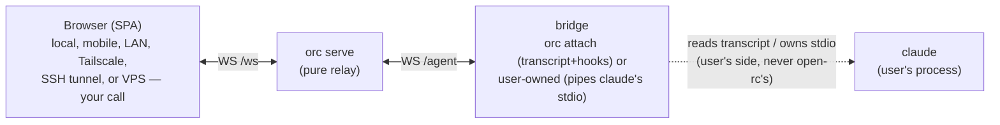
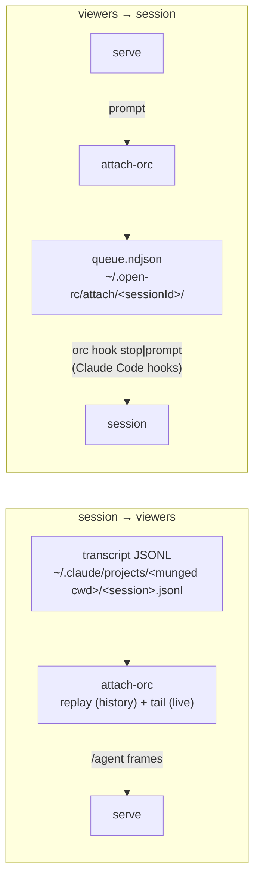

# Open Remote Control — Architecture

> **Status:** design draft for Phase 7 (pure-relay pivot). The model is
> frozen: `orc serve` is a pure WebSocket relay. It starts no
> processes and manages no `claude`; it does not even know `claude` is
> a process. The user runs `claude` themselves and brings their own
> bridge to a WebSocket.
> **Last revised:** 2026-07-03 — pure relay + the spawn-free
> `attach-orc` shared-session bridge (§3.5).

---

## 0. What this document is

The frozen reference for the shape of the system, the protocol
boundaries, and the open questions that need answering before code
lands. Updated whenever the architecture shifts.

---

## 1. Problem statement (unchanged)

Three LLM providers — **Deepseek**, **GLM (Zhipu)**, and **MiniMax**
— publish endpoints that the Claude Code CLI can talk to at the
API-request level. The CLI itself runs fine against them when the
user points `ANTHROPIC_BASE_URL` at a compatible shim.

What the CLI **cannot** do against these providers, and what
Anthropic's own Claude Code distribution gets for free, is
**RemoteControl**: drive an in-progress local session from
`claude.ai` (web) or the mobile app, get push notifications, run
`/teleport` and `/rewind`, exchange `SendUserMessage` between peer
sessions across machines.

Anthropic implements this as a private control plane between the CLI
and `wss://bridge.claudeusercontent.com`, gated by Trusted Device
enrollment. That control plane is what these providers do not — and
cannot — expose.

`open-rc` is a replacement control plane that runs against the CLI's
public `--print` stream-json mode instead of the private bridge. It
works against any provider the CLI can talk to.

---

## 2. Approach selection (unchanged)

We surveyed five close analogues on GitHub (see
[`docs/survey.md`](./survey.md)) before committing to a design.
Approach **(b)** — `claude --print --output-format stream-json` —
wins for our goal: it works against any provider the CLI supports,
resolves auth exactly like the user's own `claude -p` (OAuth,
keychain, `ANTHROPIC_API_KEY`, or a 3P provider), and uses a public
documented wire format.

The CLI is invoked by the **user** (not by open-rc) with those flags.
The control channel (our WS relay) lives next to it but doesn't have
to know about the model API.

---

## 3. Architecture: server, browser, user-side bridge

The control plane has three roles. Only one of them is open-rc.



### 3.1 `orc serve` — the relay

`orc serve` is a single Bun.serve process. It exposes:

- `GET /` → SPA static files (`ui/index.html` and friends).
- `GET /api/...` → JSON endpoints (health, push public key, push
  subscribe/unsubscribe).
- `GET /ws` → WebSocket upgrade for **browsers**.
- (Optional, hub mode) `GET /browser` and `GET /device` for hub
  enrollment.

The server does **not**:

- start any process of its own;
- walk `ps`, `lsof`, `/proc`, or any process table;
- signal any process (it starts none, so it owns none to signal);
- persist any per-session state across restarts;
- know that `claude` is a thing.

The server holds exactly one piece of mutable state:

- `clients: Map<clientId, ClientInfo>` — the set of WebSocket
  connections currently open on `/ws` (or on whatever WS route the
  user's bridge uses).

While a client is connected the server keeps a bounded, in-memory
buffer of the conversation frames it relays for that client and
replays it to any browser/`tui` that attaches — so a reload or a late
joiner sees recent history, not a blank pane. This buffer is ephemeral:
it is dropped when the bridge disconnects and is never written to disk,
so a server restart loses it (clients reconnect and it rebuilds as new
frames arrive). It is the live stream the server is already relaying,
not a read of `claude`'s transcript files.

### 3.2 Browser — the viewer

The browser SPA connects to `ws://<server>/ws`. It is a passive
viewer and a controller:

- It receives `clients_changed` whenever the set of connected
  clients changes and updates its sidebar.
- It sends `attach { clientId }` to start receiving one client's
  stream of frames.
- It sends `send { clientId, text }` to forward a prompt to that
  client.
- It receives forwarded frames as the same `WsServerMessage` shapes
  used today (text, thinking, tool_use, tool_result,
  permission_request, done, error) but tagged with the `clientId`
  they came from.

The browser never creates clients. The browser never kills clients.
The browser never sends SIGTERM to anything. It is a UI.

**Offline posture (Phase 8.1).** The SPA is installable as a PWA.
The app shell (`/`, `/app.ts`, the vendored `marked`, the icons, the
manifest) is precached by the service worker; navigation runs
NetworkFirst with a precache fallback. When the relay is unreachable
the shell still loads and the most recently attached client's cached
transcript remains visible — but the composer is disabled because
`/ws` is necessarily live-only.

**Background updates.** Long-lived installed PWAs never navigate, so
the browser's own SW update schedule (~24 h) is too lazy. Three
pieces make updates aggressive instead: (1) the server appends a
`shell-rev` fingerprint of the `ui/` directory to `/sw.js`
(`src/serve/shell-rev.ts` — paths + mtime + size, deterministic
between requests), so ANY shell change makes the served bytes differ
and registers as an SW update without manual `CACHE_VERSION` bumps;
(2) the SPA calls `registration.update()` every 5 minutes and
immediately on `visibilitychange → visible` (phone unlock / app
switch) and `online`; (3) the SW calls `skipWaiting()` after its
precache completes, and the page reloads on `controllerchange` —
parking the composer draft in `sessionStorage` first and restoring it
after the reload, so an update never eats typed input.

### 3.3 User-owned `claude` and user-owned bridge

The user runs `claude` themselves:

```
claude --print --output-format stream-json --input-format stream-json --verbose
```

The user is also responsible for whatever bridges that stream to a
WebSocket connected to `orc serve`. Examples of bridges the user
might write or use:

- `websocat` — a CLI WebSocket tool. `claude --print … | websocat
  ws://127.0.0.1:7322/ws`.
- A small Bun script that reads stdin line-by-line and writes JSON
  frames to a WS.
- tmux `capture-pane` + `send-keys` if the user wants to control a
  TTY.
- Anything else that produces a WebSocket.

`open-rc` deliberately does not ship a bridge. Shipping a bridge
implies opinionated decisions about how `claude` is run, where its
working directory is, what env vars it needs, what provider
credentials it has — and the only way to keep that bridge general
is to make it start `claude` for the user, which is forbidden.

### 3.4 Why this shape

Keeping process startup outside open-rc is deliberate:

- **No take-over.** Take-over requires the server to find a `claude`
  you started in another terminal. Banned. A pure relay never
  finds anything because it never looks.
- **Nothing to manage in the server.** The server cannot be tempted to
  "manage" a subprocess — restart it, signal it, walk `ps` to find it —
  because it starts none and none lives in its process tree.
- **Works on VPS / multi-host.** `claude` lives on the machine that
  has its working directory and credentials. The bridge lives there.
  The server can live anywhere reachable. The browser can live
  anywhere reachable. Three distinct hosts are fine.
- **No `sessions.json` on the server.** The server doesn't need to
  know what cwds are alive; the user does. The server is stateless
  beyond the live client map.
- **The server's surface doesn't grow.** The server ships exactly
  `serve` and `hub` and stays a pure relay no matter what bridge shape
  feeds it. Client-side, two helpers ship: `tui` (a `/ws` client that
  starts nothing) and `attach-orc` (a transcript bridge that starts
  nothing — it reads the JSONL the user's own session writes and
  exchanges files with the `orc hook` handlers; see §3.5). Two
  earlier helpers that launched subprocesses — the spawning
  `attach-orc` and `attach-tmux` — were built and removed on
  2026-07-02; the same day's `/orc` goal was then implemented
  spawn-free. Users can still bring any bridge of their own to
  `/agent`.

### 3.5 The `attach-orc` shared-session bridge

`/orc`, typed inside a running interactive Claude Code session,
shares THAT session:



Components:

- `src/transcript/locate.ts` — cwd → project transcript dir (every
  non-alphanumeric character becomes `-`) → newest `*.jsonl` = the
  current session (it just wrote `/orc` to itself).
- `src/transcript/translate.ts` — transcript entry → BridgeFrames
  (`user`/`text`/`thinking`/`tool_use`/`tool_result`), dropping
  sidechains, meta entries, `<command-…>` wrappers, and
  `[open-rc]`-marked round-trips (the server already echoed those).
- `src/transcript/tail.ts` — byte-offset polling tailer (300 ms),
  partial-line safe.
- `src/attach/state.ts` — the bridge ⇄ hooks filesystem contract:
  `bridge.json` heartbeat (15 s; hooks no-op when stale),
  `attached.json` viewer count (from the server's `attached` frames),
  `queue.ndjson` prompts (rename-aside drain, crash-recoverable),
  `stop.marker` (Stop hook fired → bridge sends `done`), `end.marker`
  (SessionEnd → bridge unregisters and exits).
- `src/cli/attach-hooks.ts` — `orc hook stop|prompt|end`. Stop
  drains the queue and blocks the stop with the messages as reason
  (that is how a browser prompt enters the session); while viewers are
  attached it lingers (default 45 s, `ORC_STOP_LINGER_MS`) so
  browser-driven conversation flows turn after turn.
- clientId = session id, so `/sessions/<id>` deep links survive bridge
  restarts; a second bridge on the same session fails fast on the
  duplicate-clientId register error.

The bridge holds no conversation state of its own — kill it and
nothing is lost; re-running `/orc` re-replays the transcript.

---

## 4. Wire protocols

There is exactly one protocol boundary the server defines:
browser ↔ `orc serve` on `/ws`. The other side of any client
WebSocket is the user's bridge and is opaque to the server.

### 4.1 `claude` subprocess ↔ user-owned bridge (loopback)

**Public format: stream-json** (Agent SDK). The CLI's
`--output-format stream-json` emits one JSON object per line on
stdout. Verified event types:

| Type           | Subtype              | Purpose                                |
| -------------- | -------------------- | -------------------------------------- |
| `system`       | `init`               | Session start; lists tools, MCP, model |
| `system`       | `thinking_tokens`    | Token count updates                    |
| `assistant`    | —                    | Message: thinking, text, tool_use      |
| `user`         | —                    | Echoes user input + tool_result blocks |
| `result`       | `success` / `error`  | Turn complete with metrics             |

Subtype details for `assistant.message.content[]` blocks:

| Block type   | Fields                                          |
| ------------ | ----------------------------------------------- |
| `thinking`   | `thinking`, `signature`                         |
| `text`       | `text`                                          |
| `tool_use`   | `id`, `name`, `input`                           |

Subtype details for `user.message.content[]` blocks:

| Block type     | Fields                                                  |
| -------------- | ------------------------------------------------------- |
| `text`         | `text` (only at conversation start)                     |
| `tool_result`  | `tool_use_id`, `content`, `is_error`                    |

User prompts are sent as:

```json
{"type":"user","message":{"role":"user","content":"Your prompt here"}}
```

Termination: when `claude` is done with a turn it emits a `result`
event and continues running for the next prompt (multi-turn via
stdin).

This format is **public** (Agent SDK wire format). Source:
`https://docs.claude.com/en/docs/agent-sdk/overview`.

### 4.2 User-owned bridge ↔ `orc serve` (opaque)

The user's bridge opens a WebSocket to the server. The server does
not care what protocol the bridge speaks on the client side — it
forwards whatever frames arrive. In practice, bridges will speak
the same `WsServerMessage` / `WsClientMessage` shapes the prior
phases defined, because that's what the browser already expects:

```
Bridge → Server: (frames with a clientId + payload)
Server → Bridge: (frames with a clientId + payload, e.g. user prompts)
```

The server's contract on this side is: any framed WebSocket message
arriving on `/ws` from a non-browser client is stored under a
`clientId` chosen by the bridge (or assigned by the server on first
register, if the bridge speaks a `register` frame) and fanned out to
attached browsers. That's it. The server does not validate or
transform the payload.

### 4.3 Browser ↔ `orc serve` (`/ws`)

This is the protocol the server defines.

**Browser → Server:**

```ts
type BrowserClientMessage =
  // Lifecycle: ask for the current client list.
  | { type: 'list_clients' }
  // Attach to a client's stream of frames.
  | { type: 'attach'; clientId: string }
  // Stop receiving frames from a client. Server keeps it routed for
  // other browsers; doesn't affect the bridge.
  | { type: 'detach'; clientId: string }
  // User prompt. Server forwards to the bridge as a generic frame.
  | { type: 'send'; clientId: string; text: string }
  // User decision on a forwarded permission_request.
  | { type: 'permission_response';
      clientId: string;
      requestId: string;
      approved: boolean;
    };
```

**Server → Browser:**

```ts
type BrowserServerMessage =
  // Snapshot of currently-connected clients.
  | { type: 'client_list'; clients: ClientInfo[] }
  // Broadcast whenever a new client connects.
  | { type: 'client_registered'; client: ClientInfo }
  // Broadcast whenever a client disconnects.
  | { type: 'client_removed'; clientId: string; reason?: string }
  // Broadcast whenever the set of clients changes (any reason).
  | { type: 'clients_changed'; clients: ClientInfo[] }
  // Streamed frames from the attached client, verbatim.
  | WsServerMessage;
```

Where `WsServerMessage` is the same shape as today:

```ts
type WsServerMessage =
  | { type: 'text'; sessionId: string; text: string }
  | { type: 'thinking'; sessionId: string; text: string }
  | { type: 'tool_use'; sessionId: string; tool: string; input: string }
  | { type: 'tool_result'; sessionId: string; output: string }
  | { type: 'permission_request';
      sessionId: string;
      requestId: string;
      tool: string;
      input: Record<string, unknown>;
    }
  | { type: 'done'; sessionId: string; cost?: number; duration_ms?: number }
  | { type: 'error'; sessionId: string; message: string };
```

`ClientInfo` is:

```ts
interface ClientInfo {
  readonly id: string;          // clientId the bridge registered
  readonly cwd: string;         // reported by the bridge on register
  readonly label: string;       // reported by the bridge on register
  readonly status: 'starting' | 'idle' | 'busy' | 'exited' | 'errored';
  readonly lastActivity: number; // ms since epoch
  readonly startedAt: number;   // ms since epoch
  readonly exitCode?: number;
  readonly errorMessage?: string;
}
```

### 4.4 Routing rules

The server holds two sets per client:

- `attachedBrowsers: Set<BrowserSocket>` — every browser that has
  sent `attach` for this client.
- `attachedClient: ClientSocket` — the single client WS (one bridge
  = one WS).

On any frame from a client:

1. Update `clients[clientId].lastActivity`.
2. Forward the frame to every `attachedBrowsers` for that client.

On `permission_response { clientId, requestId, approved }` from a
browser:

1. Look up the client. If absent, send `error` to that browser.
2. Forward `permission_response` to `attachedClient`.
3. (Optional) the server keeps a `pending: Map<requestId, …>` so it
   can match responses to the bridge's `permission_request` if it
   wants; this is server bookkeeping only.

On `send { clientId, text }` from a browser:

1. Validate the client exists and is connected.
2. Forward `send` to `attachedClient`.

On client WS close:

1. Mark `clients[clientId].status = 'exited'` (or `'errored'` if the
   close code is non-zero).
2. Broadcast `client_removed` to every browser.
3. Drop the client from the map after a short grace period (5 s) so
   a reconnecting client with the same id re-registers cleanly.

### 4.5 What's NOT in the protocol

- No "create session" — the browser can't make clients. The server
  can't make clients. Only the user can (by running their own bridge).
- No "kill session" from the browser — Ctrl-C on the user's bridge
  is the only way to stop a client.
- No SERVER-side reading of `claude`'s files and no history of
  *disconnected* clients — the server's only history is the in-memory
  buffer of a *currently-connected* client's stream (dropped on
  disconnect). Deep history exists because the `attach-orc` BRIDGE
  replays the session transcript into `/agent` on registration (§3.5);
  to the server those are ordinary frames.
- No `/api/external-sessions`, no `claim_external_session`, no
  process discovery.

---

## 5. Local persistence

### 5.1 What the server persists

Nothing. The server is stateless beyond the live client map, which
lives in memory only. Restart the server, lose the in-memory map,
clients reconnect, the map rebuilds.

### 5.2 What the user persists (if anything)

The user's bridge may or may not persist anything. The server
doesn't care. If the user wants to remember that "cwd X is session
Y" across restarts, that's a job for their bridge, not for open-rc.

### 5.3 What the JSONL is

`claude --print --output-format stream-json` appends one line per
event to `~/.claude/projects/<encoded-cwd>/<sessionId>.jsonl`. The
server never reads this. The browser never reads this. Only the
user's bridge reads it (if it implements resume).

---

## 6. Process management

There is no process management in `orc serve`. This section is
deliberately short.

- The server starts no `claude`.
- The server starts no other process either.
- The server does not have a subprocess table.
- The server does not know how to start, stop, restart, signal, or
  introspect any process.
- The server's process table is whatever Bun started when the user
  ran `orc serve`. That's it. Nothing else appears there.

If the user wants a `claude` running, they run it themselves. If the
user wants it bridged to open-rc, they bridge it themselves. The
moment we add any of this to the server, we re-introduce the
take-over temptation.

---

## 7. Authentication

### 7.1 Local-only mode

No auth. The server binds to `127.0.0.1`. The operator is the
presumed audience. For LAN access, bind to `0.0.0.0` and put your
own auth in front.

The user's bridge defaults to `ws://127.0.0.1:7322/agent` and assumes
the server is on the same host (browsers use `/ws`; bridges use
`/agent`). The bridge has no credentials to present; loopback is the
credential.

### 7.2 LAN / remote mode

The server is still a dumb relay. Anyone with network access to
`/ws` can read and write. Put it behind a TLS proxy with basic
auth (or Tailscale, or Cloudflare Tunnel). The bridge and the
server don't have to be on the same machine; just point the bridge
at the remote URL.

### 7.3 Hub mode

Ed25519 device enrollment. Browsers are not authenticated; put the
hub behind a TLS proxy. See [`SECURITY.md`](../SECURITY.md).

---

## 8. Findings: what we know about Claude Code internals

Captured from binary inspection (Claude Code 2.1.195, ARM64,
Bun-compiled). Kept here as a reference for anyone digging deeper.

### 8.1 Bridge protocol (not our concern)

Originally our target. Strings baked into the binary:

- `--remote-control [name]`, `--rc`, `--remote-control-session-name-prefix`
- `wss://bridge.claudeusercontent.com` (prod), `wss://bridge-staging…` (staging)
- `\.frame\.(staging\.)?claudeusercontent\.com` — URL allowlist regex
- `control_request` / `control_response` envelope types
- `[bridge:repl]`, `[bridge:attestation]`
- Trusted Device enrollment via `/login`, `CLAUDE_TRUSTED_DEVICE_TOKEN`

The CLI is hard-coded to dial `frame.claudeusercontent.com`. Override
attempts via env var do not take effect. Trusted Device enrollment
requires Anthropic OAuth which we explicitly avoid.

**Conclusion:** we don't try to redirect the bridge. The user runs
`claude` in `--print` stream-json mode.

### 8.2 `--bare` mode (evaluated, then rejected — note for any future bridge)

Discovered from binary strings + verified empirically:

> Minimal mode: skip hooks, LSP, plugin sync, attribution,
> auto-memory, background prefetches, keychain reads, and CLAUDE.md
> auto-discovery. Sets `CLAUDE_CODE_SIMPLE=1`. Anthropic auth is
> strictly `ANTHROPIC_API_KEY` or `apiKeyHelper` via `--settings`
> (OAuth and keychain are never read). 3P providers (Bedrock / Vertex
> / Foundry) use their own credentials.

Attractive at first glance (no hook/plugin interference), but the
auth clause is disqualifying in practice: on a machine that logs in
via claude.ai OAuth — no `ANTHROPIC_API_KEY` exported — every prompt
returns "Not logged in · Please run /login" (verified empirically,
2026-07-02). So a bridge (or anything that later starts `claude`) should run plain
`--print --input-format stream-json --output-format stream-json
--verbose`: the same public wire format, with auth — and hooks,
settings, CLAUDE.md — resolved exactly like the user's own
`claude -p`. Env-var providers (`ANTHROPIC_BASE_URL` +
`ANTHROPIC_API_KEY`) work identically in print mode.

### 8.3 stream-json event stream

Verified by piping real prompts into `claude --print --output-format
stream-json`. All event types and content block shapes enumerated in
§4.1. With `--include-partial-messages` (which a bridge can pass), the
stream additionally carries `stream_event` wrappers around raw API
events; `content_block_delta` / `text_delta` fragments are translated
into `text_delta` frames and relayed live — but never recorded to the
replay buffer, since the assembled `assistant` event still follows
with the complete text.

### 8.4 Provider compatibility check (DEFERRED)

The CLI handles provider differences via `ANTHROPIC_BASE_URL` and
the various 3P provider env vars. We don't need provider adapters
in this repo at all — the user already has whatever shim they use.

If we discover a provider that ships a Claude-Code-compatible
endpoint but the CLI doesn't work against it (e.g., tool use is
incompatible), we will need to revisit. For now: user configures
their own environment and runs their own `claude`. Done.

---

## 9. Open questions

### 9.1 Should `orc serve` know what `stream-json` is?

The cleanest answer is no — the server is byte-pass-through. The
browser parses `stream-json`-shaped payloads because the user
agreed with the browser on that shape.

But that pushes complexity onto the SPA. Today the SPA already
expects `WsServerMessage` shapes. If we keep that, the bridge has
to translate `stream-json` → `WsServerMessage` itself. If we want
the bridge to send raw `stream-json`, the browser needs a
translator.

**Decision (frozen for v0.x):** the server is byte-pass-through;
the bridge is responsible for translating `stream-json` →
`WsServerMessage`; the browser parses `WsServerMessage` as today.
This keeps the server dumb and gives bridges maximum flexibility.

### 9.2 Should the server validate bridge frames?

No. The server passes whatever arrives. A malicious bridge can
inject any shape it wants; the browser renders whatever it gets.
This is consistent with "the user owns their bridge" — the user
trusts their own bridge the same way they trust their own
`claude`.

If a future phase wants to add validation (e.g., zod schemas on
the client side too), it's a non-breaking addition. Not in v0.x.

### 9.3 Server-side reconnect grace period — RESOLVED (Phase 7: 5 s grace shipped, see §4.4)

When a client WS closes, do we mark the client `exited`
immediately, or wait N seconds to allow reconnect? Currently leaning
towards 5 s grace + auto-rejoin if the same clientId reconnects.
Need to verify this matches user expectations: if I restart the
server, my browser should see all my bridges come back, not have to
wait for them to re-register.

---

## 10. Out of scope

- Re-implementing the Claude Code agent loop (the user runs the
  CLI).
- Re-inventing the Anthropic Messages API.
- A full claude.ai clone (we provide a minimal RemoteControl UI).
- A SaaS product (anyone self-hosts).
- **Process discovery of external `claude` instances.** Banned by
  design. The server has no way to find one.
- **Server-side process startup.** Banned by design. The user runs `claude`.
- **Server-side subprocess management.** Banned by design. There is
  no subprocess on the server.
- **A client tool.** Banned by design. The user builds their own
  bridge.
- **Browser-side session creation.** Banned by design. The browser
  shows what bridges are currently connected; it cannot create one.

---

## 11. Glossary

| Term                 | Meaning                                                            |
| -------------------- | ------------------------------------------------------------------ |
| **CLI**              | Anthropic's `claude` binary, run by the user, never by open-rc.    |
| **`orc serve`**  | The pure WS relay — the server half of open-rc (the CLI also ships `hub`, `tui`, `attach-orc`, `hook`). |
| **Hub**              | `orc hub` — public deployment accepting remote clients (unchanged from prior phases). |
| **Bridge**           | Whatever feeds `/agent`. First-party: `orc attach`, a spawn-free transcript bridge for the session it is invoked from (§3.5). Or user-owned: any process that pipes a stream-json `claude`'s stdio to a WebSocket. (The old spawning `attach-orc`/`attach-tmux` helpers were removed as out of scope.) |
| **stream-json**      | Public Agent SDK wire format. JSONL on stdout of `claude --print`. |
| **`/ws` WS**         | The WS route on the server. Bridges and browsers both connect here. |
| **clientId**         | The id a bridge registers with the server (also used by the browser as `sessionId` for backwards compatibility). |
| **Trusted Device**   | A machine enrolled with a hub via keypair + browser confirmation.  |