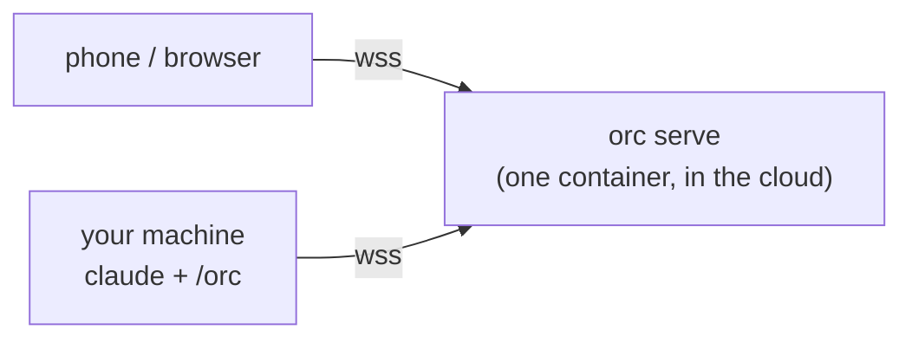

# Deploying the Open Remote Control relay

How to run `orc serve` on the common platforms — a generic VPS,
AWS ECS (Fargate), Google Cloud Run, and friends. The repo carries no
environment-specific deploy files (hosts, domains, account IDs stay in
your local tooling); this document is the pattern book.

In every layout the split is the same: **the relay runs in the cloud;
`claude`, the `/orc` bridge, and the Claude Code hooks stay on
the machine where your session lives** and dial the relay's public
URL. Your phone/browser opens the same URL.



---

## What the relay demands from a platform

Read this once; it decides most platform choices.

1. **Exactly one instance.** The client map and per-session history
   live in process memory, and a session's `/agent` (bridge) and `/ws`
   (viewers) connections must meet in the same process. Horizontal
   scaling is not "unsupported but lucky" — it is broken by design.
   Pin every platform's scaling to 1.
2. **Long-lived WebSockets.** Bridges stay connected for hours. The
   platform (and every proxy in front) must pass `Upgrade: websocket`
   and tolerate long idle connections — or the clients' reconnect
   logic will be doing constant repair (it exists: the bridge retries
   with 1–3 s backoff and re-replays history; a dropped viewer
   re-attaches and gets history replayed).
3. **State you can afford to lose, in `/data`.** The Docker image puts
   everything persistent (VAPID keypair, push subscriptions, audit
   log) under the `/data` volume. Conversations are NOT there — they
   live in the transcript on the machine running `claude`. Losing
   `/data` costs push subscriptions and audit history only.
4. **No built-in auth.** Whoever reaches the relay can watch and drive
   every shared session. Decide per deployment: private network /
   VPN / allowlist / proxy auth. (See `SECURITY.md`.)
5. **Health.** `GET /health` → `{"status":"ok",…}`. Wire it into the
   platform's health checks.

The container: build from the repo's `Dockerfile`, listens on 7322,
binds `0.0.0.0` inside the container.

---

## Generic VPS (Docker + host Nginx) — the reference layout

Best fit: cheapest, no WS timeouts you don't control, coexists with
other services on one box.

```bash
# on the VPS (once: install Docker + nginx)
rsync <repo> vps:/opt/open-rc
ssh vps 'cd /opt/open-rc && docker compose up -d --build'   # 127.0.0.1:7322
```

Then one Nginx server block routes your domain to the container —
the full block (WS upgrade on `/ws` and `/agent`, long read timeout)
is in [`docs/docker.md`](./docker.md#behind-a-host-nginx-vps-pattern).
Idempotent deploy = rsync + `compose up -d --build` + reload nginx.

TLS, two flavors:

- **Direct (DNS-only record).** certbot webroot on the VPS; origin
  serves 443 with the Let's Encrypt cert; port-80 block redirects to
  https (plus the ACME location).
- **Behind Cloudflare (proxied / orange cloud).** TLS terminates at
  the edge. With SSL mode "Flexible", Cloudflare fetches the origin
  over plain HTTP — so the origin vhost is **port 80 only, no https
  redirect** (a redirect loops: client https → CF → origin http → 301
  → …), and no certificate is needed on the origin. Cloudflare
  proxies WebSockets and drops *idle* ones after ~100 s — the relay
  defuses this by keepalive-pinging every connection every 30 s, and
  the bridge additionally treats 120 s of server silence as a
  half-open link and reconnects. With SSL mode "Full", give the
  origin a cert (Cloudflare origin certificate is the easy one) and
  keep the 443 block instead.

## AWS ECS (Fargate)

Fit: good. WS-friendly, persistent volume available, always-on.

- **Image**: `docker build -t open-rc . && docker tag … && docker push`
  to ECR.
- **Service**: one Fargate service, `desiredCount: 1`,
  `deploymentConfiguration: { maximumPercent: 100, minimumHealthyPercent: 0 }`
  (never two tasks at once — see demand #1; brief downtime on deploy
  is the correct trade).
- **Task**: 0.25 vCPU / 512 MB is plenty. Container port 7322.
  Optionally mount an EFS access point at `/data` for push/audit
  persistence; skip it and pass `--pushDisabled` if you don't use push.
- **ALB**: HTTPS listener (ACM cert) → target group to port 7322,
  health check path `/health`. Raise the ALB **idle timeout**
  (default 60 s kills quiet WebSockets; it goes up to 4000 s).
  WebSocket upgrade works out of the box on ALB.
- **Exposure**: security group / VPN / IP allowlist — the relay has
  no auth beyond the optional built-in login gate
  (`ORC_USER`/`ORC_PASSWORD`).

Task definition sketch:

```json
{
  "family": "open-rc",
  "cpu": "256", "memory": "512",
  "networkMode": "awsvpc",
  "requiresCompatibilities": ["FARGATE"],
  "containerDefinitions": [{
    "name": "open-rc",
    "image": "<account>.dkr.ecr.<region>.amazonaws.com/open-rc:latest",
    "portMappings": [{ "containerPort": 7322 }],
    "mountPoints": [{ "sourceVolume": "data", "containerPath": "/data" }],
    "healthCheck": {
      "command": ["CMD", "bun", "-e",
        "fetch('http://127.0.0.1:7322/health').then(r=>process.exit(r.ok?0:1),()=>process.exit(1))"]
    }
  }],
  "volumes": [{ "name": "data",
    "efsVolumeConfiguration": { "fileSystemId": "fs-…" } }]
}
```

## Google Cloud Run

Fit: workable, with caveats — Cloud Run caps every request's duration,
and a WebSocket is one request.

```bash
gcloud run deploy open-rc \
  --source . \
  --port 7322 \
  --min-instances 1 --max-instances 1 \
  --timeout 3600 \
  --no-cpu-throttling \
  --allow-unauthenticated
```

- `--max-instances 1` is **mandatory** (demand #1); `--min-instances 1`
  keeps the relay from scaling to zero and dropping every bridge.
- `--timeout 3600` (the max) means every WebSocket is severed at most
  hourly; bridge and viewers auto-reconnect and history is replayed,
  so it heals, but expect a visible blip per hour.
- The filesystem is in-memory: `/data` does not survive restarts.
  Run with `--pushDisabled` (append it after the image args) or accept
  re-subscribing to push after each revision/restart.
- `--allow-unauthenticated` is what it says — front it with IAP / your
  own proxy if the URL must not be public.

If any of those caveats hurt, prefer ECS or a VPS.

## Fly.io (and similar single-machine platforms)

Fit: good, minimal ceremony.

```toml
# fly.toml (sketch)
app = "open-rc"
[build]
[http_service]
  internal_port = 7322
  force_https = true
  auto_stop_machines = false   # a stopped machine = all bridges dropped
  min_machines_running = 1
[mounts]
  source = "open_rc_data"
  destination = "/data"
```

One machine, a volume on `/data`, WebSockets pass through natively.
`fly deploy` after `fly launch`. Keep machine count at 1.

---

## Comparison

| | WebSockets | single-instance pin | `/data` persistence | always-on | note |
|---|---|---|---|---|---|
| VPS + Nginx | native, no cap | you control it | docker volume | yes | reference layout; cheapest |
| ECS Fargate | ALB (idle ≤ 4000 s) | `desiredCount 1`, `maxPercent 100` | EFS | yes | most knobs, most YAML |
| Cloud Run | capped at `--timeout` (≤ 1 h) | `--max-instances 1` | none (tmpfs) | `--min-instances 1` | hourly WS blip, no push persistence |
| Fly.io | native | 1 machine | fly volume | `auto_stop_machines = false` | smallest ceremony |

In all cases the client side is identical:

```bash
export ORC_BASE_URL=https://<your-relay-domain>
/orc            # inside claude
orc tui            # terminal view of the same session
```
