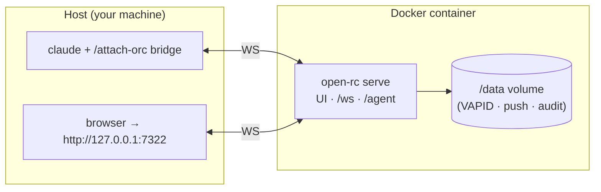

# Running Open Remote Control with Docker

One image contains the whole CLI. `serve` — the relay + SPA — is the
default command, so "start the server" is one line. The container is
the **relay half only**: `claude`, the `/attach-orc` bridge, and the
Claude Code hooks always run on the host (or wherever your `claude`
lives) and dial the container's published port.



---

## Quick start (docker compose — recommended)

```bash
git clone https://github.com/kohei/open-rc.git
cd open-rc
docker compose up -d
```

That's it. The relay is up:

- UI: <http://127.0.0.1:7322/>
- browsers / `tui`: `ws://127.0.0.1:7322/ws`
- bridges (`/attach-orc` lands here): `ws://127.0.0.1:7322/agent`

Then share a session exactly as without Docker — inside any running
Claude Code session on the host:

```
/attach-orc
```

(`/attach-orc` needs the host-side setup once: `make setup` installs
the `open-rc` launcher, the Claude Code hooks, and the slash command.
Docker replaces only the server, not the bridge side.)

Day-to-day:

```bash
docker compose logs -f      # follow the relay logs
docker compose down         # stop (data volume survives)
docker compose up -d --build   # after a git pull: rebuild + restart
```

Or through make, with the usual banner:

```bash
make docker-serve           # compose up -d --build
make docker-logs
make docker-stop
```

## Quick start (plain docker, no compose)

```bash
docker build -t open-rc .
docker run -d \
  --name open-rc \
  --restart unless-stopped \
  -p 127.0.0.1:7322:7322 \
  -v open-rc-data:/data \
  open-rc
```

Stop/remove with `docker stop open-rc && docker rm open-rc`. The named
volume `open-rc-data` keeps your state either way.

---

## Ports and exposure

Inside the container the relay binds `0.0.0.0:7322` (it has to — the
container's loopback is unreachable from outside). **The `-p` mapping
is therefore the real exposure decision**:

| Mapping | Meaning |
| ------- | ------- |
| `127.0.0.1:7322:7322` (default) | Loopback only — same trust model as bare `open-rc serve`. |
| `7322:7322` | Every interface on the host. The relay has **no authentication**: anyone who can reach the port can read every shared session and type into it. Do this only behind TLS + auth (reverse proxy, Tailscale, VPN). See `SECURITY.md`. |
| `127.0.0.1:9000:7322` | Different host port; the container side stays 7322. |

To use a different host port, change the left-hand side of the
mapping — don't change the container port or the `CMD`.

## The `/data` volume

Everything the relay persists honors `XDG_DATA_HOME`, which the image
sets to `/data`:

| File | What it is | If you delete it |
| ---- | ---------- | ---------------- |
| `/data/open-rc/vapid.json` | Web-Push VAPID keypair (contains the private key — treat as secret) | all browser push subscriptions invalidate; users re-subscribe |
| `/data/open-rc/push.db` | push subscription store (SQLite) | subscribers silently gone |
| `/data/open-rc/audit.jsonl` | append-only audit log | history lost, nothing breaks |

Conversation content is **never** in the volume — the relay is
stateless about conversations (in-memory only). Losing `/data` loses
push subscriptions and audit history, nothing else.

Backup / inspect / reset:

```bash
docker run --rm -v open-rc-data:/data alpine tar cz -C /data . > open-rc-data.tgz
docker run --rm -v open-rc-data:/data alpine ls -la /data/open-rc
docker compose down && docker volume rm open-rc_open-rc-data   # full reset
```

## Connecting things to the containerized relay

Everything on the host talks to the published port — no special
Docker awareness needed, because the defaults already point at
`127.0.0.1:7322`:

```bash
/attach-orc                  # inside claude — works as-is
open-rc tui                  # host tui — works as-is
```

Non-default port or a relay on another machine: set `ORC_BASE_URL`
once, everything derives `/ws` and `/agent` from it:

```bash
export ORC_BASE_URL=http://127.0.0.1:9000        # remapped local port
export ORC_BASE_URL=https://orc.example.com      # VPS behind TLS proxy
/attach-orc                                       # bridge dials $ORC_BASE_URL/agent
```

Typical VPS layout: the container runs on the VPS
(`-p 127.0.0.1:7322:7322` + a TLS-terminating, authenticated reverse
proxy in front); your laptop runs `claude`, and `/attach-orc` with
`ORC_BASE_URL=https://…` pushes the session up to it; your phone opens
the proxy URL.

### Behind a host Nginx (VPS pattern)

The repo carries **no** environment-specific deploy files — hosts,
domains, and scripts are your local tooling (keep them under `vps/`,
which is gitignored). The pattern itself, for a VPS whose host Nginx
routes by `server_name` and can host other services beside open-rc:

1. rsync the repo to the VPS, `docker compose up -d --build` there —
   the container stays on `127.0.0.1:7322`.
2. Add a server block for your domain. The only open-rc-specific
   requirement is **WebSocket upgrade on `/ws` and `/agent`** with a
   long read timeout:

```nginx
server {
    listen 443 ssl;
    server_name orc.example.com;
    ssl_certificate     /etc/letsencrypt/live/orc.example.com/fullchain.pem;
    ssl_certificate_key /etc/letsencrypt/live/orc.example.com/privkey.pem;

    # WebSockets: browsers/tui (/ws) and bridges (/agent)
    location ~ ^/(ws|agent)$ {
        proxy_pass http://127.0.0.1:7322;
        proxy_http_version 1.1;
        proxy_set_header Upgrade $http_upgrade;
        proxy_set_header Connection "upgrade";
        proxy_set_header Host $host;
        proxy_buffering off;
        proxy_read_timeout 7d;
    }

    # SPA shell, assets, deep links, push API
    location / {
        proxy_pass http://127.0.0.1:7322;
        proxy_set_header Host $host;
    }
}
```

3. Certificate via certbot webroot (add the usual port-80 block with
   `/.well-known/acme-challenge/`), DNS A record → the VPS.
4. From your machine: `export ORC_BASE_URL=https://orc.example.com`,
   then `/attach-orc` inside claude. Browser/phone opens the domain.

The relay has no authentication of its own — decide deliberately
whether the domain is reachable only via VPN/allowlist or gets an
auth layer in the proxy (see `SECURITY.md`).

## Other commands, same image

The image's entrypoint is the open-rc CLI, so every command rides it:

```bash
docker run -d -p 127.0.0.1:7443:7443 -v open-rc-data:/data open-rc \
  hub --host 0.0.0.0 --port 7443                  # hub relay

docker run --rm -it open-rc \
  tui --server ws://host.docker.internal:7322/ws  # tui (talking to a
                                                  # relay on the host)
```

`attach-orc` and `hook` exist in the image but are pointless inside a
container — they read the transcript/hook files of a `claude` session,
and there is no `claude` in the container. Run those on the host.

## Health, upgrades, troubleshooting

- **Health.** The image has a built-in HEALTHCHECK probing `/health`
  with Bun (no curl in the image). `docker ps` shows `(healthy)`;
  `curl http://127.0.0.1:7322/health` returns
  `{"status":"ok","clients":N,"push":"ok"}`.
- **Upgrade.** `git pull && docker compose up -d --build`. The image
  runs from source, so a rebuild is the whole upgrade; `/data` carries
  your state across.
- **`EADDRINUSE` / port already allocated.** A bare `open-rc serve`
  (or another container) already owns host port 7322. Stop it, or
  remap the compose port. Bare serve and Docker serve are the same
  relay — run one or the other, not both on one port.
- **Bridge can't register (`registration … did not complete`).** The
  container isn't up (`docker compose ps`), the port mapping doesn't
  match `ORC_BASE_URL`, or a previous bridge for the same session is
  still connected (one bridge per session).
- **Browser can't reach the UI from another device.** That's the
  loopback binding doing its job — see [Ports and exposure](#ports-and-exposure).

## What is (deliberately) not in the image

No `claude`, no bridge, no hooks, no tmux, no PTY, no `child_process`
— the container relays frames and serves the SPA, nothing else. Do
not bake a `claude` into it; sharing an already-running session from
the host is the whole design (see `CLAUDE.md`).
