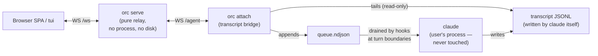

# Issue: the shared-session UX is not interactive enough

Status: **open** — written 2026-07-06 at the owner's request
("もっとインタラクティブにしたい。今のユーザー体験は最悪").

This document describes the architecture as it exists today, why its
user experience is structurally poor, what can still be improved
within the current constraints, and which options would change the
ceiling but require an owner-level decision.

---

## 1. Current architecture

- **`orc serve`** relays frames between viewers (`/ws`) and bridges
  (`/agent`). Stateless beyond an in-memory client map and a bounded
  replay buffer (last 50 frames replayed on attach).
- **`orc attach`** (run by `/orc` inside the session) reads the
  session's own transcript JSONL — replay + live tail — for the
  session→browser direction. It never owns or signals the process.
- **Hooks** (`orc hook …`, installed into `~/.claude/settings.json`)
  are the ONLY browser→session channel:
  - **Stop** (turn end): drains the queue and *blocks* the stop with
    the messages as reason — that is how a browser prompt enters the
    session. It lingers listening for 45 s (`ORC_STOP_LINGER_MS`),
    re-armed by viewer attach events; exits instantly at zero viewers.
  - **Browser-driven mode**: once a browser message is actually
    DELIVERED, the linger becomes unlimited (until a prompt is typed
    in the terminal, which restores the short window).
  - **UserPromptSubmit**: queued messages ride along as context when
    the terminal user types.
  - **PreToolUse (AskUserQuestion)**: relays multiple-choice questions
    to viewers and returns their answer (browser-driven mode only).
  - **Notification**: prints "browser message waiting" in an idle
    terminal (display-only; cannot inject).

Two empirical facts (verified 2026-07-03 on a live claude in tmux)
govern everything:

1. A prompt **typed during a running Stop hook queues until the hook
   exits** — it does not cancel the hook.
2. **Esc cancels a running hook instantly** and returns the prompt.

---

## 2. Why the UX is bad — concrete problems

### P1 — The dead zone (the "message queued" error)

The primary flow — `/orc`, then open the page, then send — usually
hits it: the `/orc` turn ends with no viewer attached, so the Stop
hook exits immediately; the viewer attaches *after* that; the first
message finds no listener and is queued with
"message queued — the session is idle…". On an unattended terminal
nothing ever picks it up. The flagship feature fails on first contact.

### P2 — The window policy is a lose-lose dial

Because of empirical fact 1, a lingering hook **captures the
terminal**; because delivery only happens through a lingering hook,
a short window **drops remote messages**. There is no value of the
dial that satisfies both:

| Policy | Result |
|---|---|
| 45 s window (original) | remote replies routinely missed the window |
| 5 min / 30 min | "cliffs" — user fell off both (2026-07-03) |
| unlimited on attach/start | claude froze right after `/orc` (2026-07-06) |
| unlimited only after a delivery (today) | P1 dead zone is back for the first message |

We have moved this dial four times. It is not tunable into a good
experience — the mechanism itself is the problem.

### P3 — Turn-end-only latency

Even on the happy path, a browser message waits for the **current
turn to finish**. During a long tool-heavy turn (minutes), the remote
user can watch the stream but cannot steer, correct, or stop it.
There is no browser-side equivalent of Esc (interrupt) at all —
nothing outside the TTY can stop a running turn.

### P4 — Asymmetric duplex

Session→browser is live streaming (text deltas, tool activity).
Browser→session is a **mailbox with pickup times**. The combination
feels like reading a live log while replying by email — not like
chatting with the session.

### P5 — An invisible state machine

Listening windows, browser-driven mode, re-arming on attach,
Esc-to-reclaim: none of this state is visible. Users experience only
its failure modes ("claude hung", "my message shows an error"), and
the correct next action (press Esc / type anything / just wait) is
never on screen.

### P6 — Accumulated approximations

- Turn boundaries are *inferred* from transcript entries plus marker
  files, patched by stuck-turn fuses (`QUIET_TURN_MS`,
  `STUCK_TURN_MS`) — dividers and busy state are heuristics.
- AskUserQuestion relays only in browser-driven mode; in CLI-driven
  sessions the browser is a spectator.
- Permission prompts of the interactive session are not relayed at
  all (a PreToolUse gate would fight the native permission flow).

---

## 3. Root cause

An interactive `claude` has **exactly one input channel: its own
TTY**. open-rc's foundational rule is to never touch the process
(no spawn, no PTY, no tmux, no signals — CLAUDE.md "Project goal").
Under that rule the only injection points are hooks, and hooks are:

- **turn-boundary-only** — they exist when a turn ends, a prompt is
  submitted, or a tool is about to run; an idle session offers no
  hook moments at all, and
- **TTY-blocking while running** — a hook that waits for remote input
  steals the terminal from the local user.

Every problem in §2 is a corollary. This is a **ceiling, not a set of
bugs**: within the current rules, browser→session will always be
store-and-forward with windows, and an idle session with an
unattended terminal will always be unreachable.

---

## 4. What can still improve within the rules (incremental)

- **I1 — Mid-turn delivery via PreToolUse.** A PreToolUse hook fires
  before *every tool call*, and a deny-reason demonstrably reaches
  the model (our AskUserQuestion relay is built on it). Draining the
  queue there would cut delivery latency from "end of turn" to "next
  tool call" during busy turns, enabling real mid-turn steering
  ("stop, wrong file!"). Cost: sacrifices one tool call when it
  fires; needs care to not disrupt the turn.
- **I2 — Make the state visible.** Replace the error-styled idle
  notice with an honest per-session status in the UI ("listening /
  idle — will deliver on next activity"), show a "waiting for pickup"
  badge on queued messages and flip it on delivery.
- **I3 — Web Push on pickup.** Push already fires on `done`; also
  notify when a queued message is finally delivered, so the remote
  user can walk away after sending into a dead zone.
- **I4 — First-run guidance.** `/orc` output and the empty-state UI
  should teach the two gestures that exist (type to deliver, Esc to
  reclaim).

These soften P3/P5 and the *perception* of P1. **None of them touch
the ceiling**: no interrupt from the browser, no waking an idle
session, terminal capture vs. missed messages remains a dial.

---

## 5. Options that change the ceiling (owner decision required)

### O1 — Owned-session mode (spawn, as a NEW opt-in command)

A separate command (e.g. `orc run`) that **spawns and owns**
`claude --print --input-format stream-json --output-format
stream-json --verbose` and bridges its stdio to `/agent`. This is the
public wire format (not the private RemoteControl protocol) and gives
**chat-grade UX**: instant bidirectional messages, no windows, no
hooks, streaming both ways, clean turn boundaries, permission
prompts and questions relayable natively. The terminal joins via
`orc tui` instead of owning the process — the mirror image of today.

Costs / history: it is a *new* session (not the already-running
terminal one — `/orc` would remain unchanged for that), and it
requires **explicitly reversing the repo's permanent no-spawn rule**
for this one command. A spawning `attach-orc` was deliberately
removed on 2026-07-02; CLAUDE.md declares launching "permanently out
of scope". That reversal is exactly the decision this issue asks for.
(Hard-won note kept in CLAUDE.md: spawn `--print`, never `--bare` —
bare mode breaks subscription auth.)

### O2 — PTY/tmux injection into the real terminal

`tmux send-keys` (or a PTY proxy) types the browser message into the
user's actual terminal: true both-sides interactivity on the *same*
session. Banned today, brittle (requires tmux, races with the TUI),
and reads keystrokes into a UI we don't control. Listed for
completeness; not recommended.

### O3 — Upstream: native remote-input API

The clean fix belongs in Claude Code itself (RemoteControl exists but
is locked to claude.ai OAuth + trusted devices). No public API today
for injecting input into a running interactive session. Worth
tracking releases; not actionable now.

---

## 6. Recommendation

1. Do **I1–I4** now — they need no decisions and remove the worst
   sharp edges (mid-turn steering, honest status instead of scary
   errors).
2. Decide on **O1**. If "interactive like a chat app" is the actual
   bar — and "今のユーザー体験は最悪" suggests it is — no amount of
   hook tuning reaches it. O1 is the only path that does, at the cost
   of amending the no-spawn rule for one explicitly-owned command
   while `/orc` keeps its spawn-free guarantee for existing sessions.
